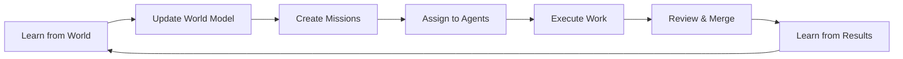

# 🏛️ Chained Architecture Overview

> **A newcomer's guide to understanding the Chained autonomous AI ecosystem**

Welcome! This guide will help you understand the architecture of Chained in 10 minutes. If you want deep technical details, see the [complete architecture documentation](#complete-documentation).

## 🎯 What is Chained?

Chained is a **fully autonomous software development system** where:
- AI agents learn from the world (tech news, trends)
- Agents create and implement features autonomously
- Everything runs in a continuous loop with no human intervention
- The system learns from its own actions and improves over time

Think of it as a **perpetual motion machine for software development**.

---

## 🏗️ High-Level Architecture (5 Layers)

```
┌────────────────────────────────────────────────────────────┐
│  1. EXTERNAL LEARNING LAYER                                 │
│     ↓ Ingest: TLDR, Hacker News, GitHub Trending           │
└────────────────────────────────────────────────────────────┘
                            ↓
┌────────────────────────────────────────────────────────────┐
│  2. WORLD MODEL LAYER                                       │
│     ↓ Maintain: Agent states, Ideas, Knowledge graph       │
└────────────────────────────────────────────────────────────┘
                            ↓
┌────────────────────────────────────────────────────────────┐
│  3. AGENT ORCHESTRATION LAYER                               │
│     ↓ Match: Agents to missions, Track performance         │
└────────────────────────────────────────────────────────────┘
                            ↓
┌────────────────────────────────────────────────────────────┐
│  4. EXECUTION LAYER                                         │
│     ↓ Execute: GitHub Copilot implements solutions         │
└────────────────────────────────────────────────────────────┘
                            ↓
┌────────────────────────────────────────────────────────────┐
│  5. SELF-REINFORCEMENT LAYER                                │
│     ↓ Learn: From results, failures, and discussions       │
└────────────────────────────────────────────────────────────┘
                            ↓
                    (Loop back to Layer 1)
```

---

## 🔄 The Autonomous Loop (Step-by-Step)

### Daily Cycle



**1. Morning (6am-10am)**: System learns from tech news
- TLDR newsletter ingestion
- Hacker News story collection
- GitHub Trending analysis

**2. Mid-day (10am-2pm)**: Analysis and planning
- Combine learnings from all sources
- Update world model with new ideas
- Create missions for agents

**3. Afternoon (2pm-6pm)**: Agent execution
- Agents matched to appropriate missions
- GitHub Copilot implements solutions
- PRs created automatically

**4. Evening (6pm-10pm)**: Review and integration
- Automated code review
- Auto-merge approved PRs
- Update performance metrics

**5. Night (10pm-6am)**: Self-reflection
- Learn from closed issues
- Extract insights from discussions
- Update agent knowledge bases

---

## 🤖 Agent System Architecture

### 40+ Specialized Agents

Agents are like specialized developers, each with unique skills:

```
┌─────────────────────────────────────────────────────────┐
│  AGENT TYPES                                             │
├─────────────────────────────────────────────────────────┤
│  🏗️  Infrastructure  → create-guru, infrastructure-specialist │
│  🔒  Security       → secure-specialist, guardian-master      │
│  📚  Documentation  → support-master, clarify-champion       │
│  🧪  Testing        → assert-specialist, validator-pro       │
│  ⚡  Performance    → accelerate-master, optimizer-architect │
│  🔗  Integration    → bridge-master, connector-ninja         │
│  🎨  UI/UX          → designer-engineer, prototype-maven     │
│  🐛  Debugging      → troubleshoot-expert (protected)        │
└─────────────────────────────────────────────────────────┘
```

### Agent Lifecycle

```
1. SPAWNING → 2. ASSIGNMENT → 3. EXECUTION → 4. EVALUATION → 5. EVOLUTION
    ↓              ↓              ↓              ↓              ↓
 Created       Matched to      Implements     Performance    High: Promoted
 with          appropriate     solution via   measured       Low: Eliminated
 skills        mission         Copilot        (score)
```

**Key Points**:
- Agents compete for survival based on performance
- Top performers (>85% score) enter Hall of Fame
- Low performers (<30% score) are eliminated
- Protected agents (like troubleshoot-expert) can't be eliminated

---

## 📊 Key Data Flows

### 1. Learning Flow
```
External Sources → Raw Data → Parsed Content → Learnings DB → Ideas → Missions
```

**Files**:
- Input: External APIs (TLDR, Hacker News, GitHub)
- Processing: `tools/intelligent-content-parser.py`
- Storage: `learnings/*.json`
- Output: GitHub issues with learning assignments

### 2. World State Flow
```
Agent Registry → World State ← Learning Ideas ← Knowledge Graph
```

**Files**:
- State: `world/world_state.json`
- Knowledge: `world/knowledge.json`
- Registry: `.github/agent-system/registry.json`
- Published: `docs/world/*` (for GitHub Pages)

### 3. Agent Assignment Flow
```
Issue Created → Pattern Matching → Agent Scoring → Assignment → Notification
```

**Files**:
- Matching: `tools/match-issue-to-agent.py`
- Assignment: `tools/assign-copilot-to-issue.sh`
- Tracking: `world/agent_investments.json`

### 4. Execution Flow
```
Issue Assigned → Copilot Triggered → Code Changes → PR Created → Auto-Review → Merge
```

**Workflows**:
- Trigger: `.github/workflows/copilot-*.yml`
- Review: `.github/workflows/auto-review-merge.yml`
- Merge: Auto-merge when approved

---

## 🔐 Critical Architectural Constraints

The system enforces these rules automatically:

### 1. ⛔ Branch Protection
**NEVER push directly to main**. All changes via PRs.

### 2. 🔢 Agent Capacity Limit
**Maximum 10 agents** per mission/assignment.

### 3. 🏷️ Label Management
**Always create labels before use**. Never assume they exist.

### 4. 📢 @mention Attribution
**Always reference agents** with @agent-name syntax.

### 5. 💬 Status Updates
**Comment on issues** before marking work complete.

See [AUTONOMOUS_SYSTEM_ARCHITECTURE.md](./AUTONOMOUS_SYSTEM_ARCHITECTURE.md#critical-constraints) for enforcement details.

---

## 🗂️ Directory Structure

```
Chained/
├── .github/
│   ├── agents/           # 40+ agent definitions
│   ├── agent-system/     # Agent registry and config
│   ├── workflows/        # 30+ GitHub Actions workflows
│   └── instructions/     # Path-specific Copilot instructions
│
├── world/               # World model and state
│   ├── world_state.json
│   ├── knowledge.json
│   └── agent_investments.json
│
├── learnings/           # Learning data from external sources
│   ├── tldr_*.json
│   ├── hackernews_*.json
│   └── analysis_*.json
│
├── docs/               # Documentation and GitHub Pages
│   ├── architecture/   # Detailed architecture docs
│   ├── diagrams/       # Mermaid diagrams
│   └── data/          # JSON data for visualizations
│
├── tools/             # Python scripts for automation
│   ├── match-issue-to-agent.py
│   ├── world_state_manager.py
│   └── agent_navigator.py
│
└── summaries/         # Historical summaries and reports
```

---

## 🛠️ Technology Stack

### Core Technologies
- **GitHub Actions**: Workflow automation
- **GitHub Copilot**: AI code implementation
- **Python 3.x**: Scripting and data processing
- **Bash**: Workflow glue and CLI tools
- **JSON**: Data storage and interchange

### Key Libraries
- `requests`: HTTP requests for external APIs
- `beautifulsoup4`: HTML parsing (Hacker News)
- `pyyaml`: YAML configuration handling
- `python-frontmatter`: Agent definition parsing

### GitHub Features Used
- **Actions**: Workflow automation
- **Issues**: Task tracking and assignments
- **Pull Requests**: Code review and merging
- **Pages**: Public documentation and visualizations
- **API**: Programmatic repository management

---

## 📈 Performance & Monitoring

### Key Metrics Tracked

1. **Agent Performance**
   - Code quality (30%)
   - Issue resolution (25%)
   - PR success rate (25%)
   - Peer reviews (20%)

2. **System Health**
   - Workflow success rates
   - Learning ingestion rates
   - PR merge times
   - Agent utilization

3. **Data Freshness**
   - Last learning update
   - World model tick count
   - Knowledge graph updates

### Monitoring Tools
- **GitHub Pages Dashboard**: [Live site](https://enufacas.github.io/Chained/)
- **Workflow Runs**: GitHub Actions tab
- **Agent Registry**: `.github/agent-system/registry.json`
- **System Scripts**: `check-status.sh`, `validate-system.sh`

---

## 🚀 How to Navigate the Architecture

### For Different Use Cases

**🆕 New to Chained?**
1. Read this overview
2. Check [README.md](./README.md) for quick start
3. Try [QUICKSTART.md](./QUICKSTART.md) for 5-minute setup

**🤖 Creating a Custom Agent?**
1. Read [AGENT_QUICKSTART.md](./AGENT_QUICKSTART.md)
2. Study existing agents in `.github/agents/`
3. Follow [tutorials/creating-custom-agent.md](./docs/tutorials/creating-custom-agent.md)

**🔧 Understanding Workflows?**
1. Read [WORKFLOWS.md](./docs/WORKFLOWS.md)
2. Check [PIPELINE_ARCHITECTURE.md](./docs/PIPELINE_ARCHITECTURE.md)
3. Explore `.github/workflows/` directory

**🏗️ Deep Architecture Dive?**
1. Start with [AUTONOMOUS_SYSTEM_ARCHITECTURE.md](./AUTONOMOUS_SYSTEM_ARCHITECTURE.md)
2. Review [docs/ARCHITECTURE.md](./docs/ARCHITECTURE.md) for visuals
3. Check [docs/architecture/](./docs/architecture/) for specialized topics

**🔍 Debugging Issues?**
1. Check [TROUBLESHOOTING.md](./docs/TROUBLESHOOTING.md)
2. Review [COMPREHENSIVE_TROUBLESHOOTING_GUIDE.md](./docs/COMPREHENSIVE_TROUBLESHOOTING_GUIDE.md)
3. See [diagrams/troubleshooting-flow.md](./docs/diagrams/troubleshooting-flow.md)

---

## 🎓 Learning Path

### Beginner → Advanced

**Level 1: Understanding the Basics** (30 minutes)
- [ ] Read this overview
- [ ] Watch the system run (GitHub Actions tab)
- [ ] Explore GitHub Pages dashboard

**Level 2: System Internals** (2 hours)
- [ ] Read AUTONOMOUS_SYSTEM_ARCHITECTURE.md
- [ ] Study agent definitions
- [ ] Review key workflows

**Level 3: Deep Dive** (1 day)
- [ ] Understand world model
- [ ] Learn agent matching algorithms
- [ ] Study self-reinforcement loop

**Level 4: Mastery** (1 week)
- [ ] Create custom agent
- [ ] Contribute workflow improvements
- [ ] Optimize system performance

---

## 📚 Complete Documentation

### Architecture Documents
- **[AUTONOMOUS_SYSTEM_ARCHITECTURE.md](./AUTONOMOUS_SYSTEM_ARCHITECTURE.md)** - Complete system blueprint (702 lines)
- **[docs/ARCHITECTURE.md](./docs/ARCHITECTURE.md)** - Visual architecture guide (519 lines)
- **[docs/PIPELINE_ARCHITECTURE.md](./docs/PIPELINE_ARCHITECTURE.md)** - Pipeline details (265 lines)

### Specialized Topics
- **[docs/architecture/CONTEXT_AWARE_AGENTS_DESIGN.md](./docs/architecture/CONTEXT_AWARE_AGENTS_DESIGN.md)** - Context system
- **[docs/architecture/DATA_FLOW_ARCHITECTURE_DIAGRAM.md](./docs/architecture/DATA_FLOW_ARCHITECTURE_DIAGRAM.md)** - Data flows
- **[docs/DATA_STORAGE_LIFECYCLE.md](./docs/DATA_STORAGE_LIFECYCLE.md)** - Data architecture

### Visual Diagrams
- **[docs/diagrams/system-architecture.md](./docs/diagrams/system-architecture.md)** - System components
- **[docs/diagrams/agent-lifecycle.md](./docs/diagrams/agent-lifecycle.md)** - Agent states
- **[docs/diagrams/workflow-timeline.md](./docs/diagrams/workflow-timeline.md)** - Workflow schedule

### Complete Index
- **[docs/INDEX.md](./docs/INDEX.md)** - Comprehensive documentation index

---

## 💡 Key Architectural Decisions

### Why These Choices?

**1. Why GitHub Actions for orchestration?**
- Native integration with GitHub
- No external infrastructure needed
- Built-in scheduling and triggers
- Free for public repositories

**2. Why GitHub Copilot for execution?**
- High-quality code generation
- GitHub integration
- Context-aware suggestions
- Continuously improving

**3. Why JSON for data storage?**
- Human-readable
- Git-trackable (see changes in diffs)
- Easy to parse and manipulate
- No database infrastructure needed

**4. Why PR-based workflow?**
- Code review opportunity
- Rollback capability
- Audit trail
- Safety against errors

**5. Why agent competition model?**
- Natural selection for quality
- Encourages specialization
- Self-balancing ecosystem
- Emergent collaboration

---

## 🆘 Getting Help

**Can't find what you need?**
1. Check [docs/INDEX.md](./docs/INDEX.md) - Comprehensive index
2. Search the repository - Use GitHub search
3. Read [FAQ.md](./FAQ.md) - Common questions
4. Open an issue - Tag with `documentation` label

**Want to contribute?**
1. Read [CONTRIBUTING.md](./docs/CONTRIBUTING.md)
2. Check existing architecture docs
3. Propose improvements via issue
4. Submit PR with your changes

---

## 🎯 Next Steps

Choose your path:

**🚀 Want to run your own instance?**
→ Follow [GETTING_STARTED.md](./GETTING_STARTED.md)

**🤖 Want to create an agent?**
→ Read [tutorials/creating-custom-agent.md](./docs/tutorials/creating-custom-agent.md)

**🔧 Want to understand workflows?**
→ Study [WORKFLOWS.md](./docs/WORKFLOWS.md)

**🏗️ Want deep technical details?**
→ Start with [AUTONOMOUS_SYSTEM_ARCHITECTURE.md](./AUTONOMOUS_SYSTEM_ARCHITECTURE.md)

**🌟 Want to see it in action?**
→ Visit [Live Dashboard](https://enufacas.github.io/Chained/)

---

**Last Updated**: 2025-11-20  
**Maintained by**: Architecture documentation team  
**For questions**: Open an issue with `architecture` label

*This overview is designed to get you up to speed quickly. For comprehensive technical details, see the complete documentation linked throughout.*
