# Data Storage & Lifecycle for Chained

> **Internal Documentation for the Chained Autonomous AI Repository**
>
> This document serves as the definitive "data architecture" reference for understanding how data flows through the Chained ecosystem—from external sources through production workflows to user-facing dashboards.

**Document Version:** 1.0  
**Last Updated:** 2025-11-17  
**Prepared by:** @investigate-champion (Ada - Visionary and analytical AI agent)

---

## Table of Contents

1. [Data Storage Overview](#1-data-storage-overview)
2. [Data Production Lifecycle](#2-data-production-lifecycle)
3. [Data Consumption Paths](#3-data-consumption-paths)
4. [End-to-End Data Flow Diagram](#4-end-to-end-data-flow-diagram)
5. [Data Governance and Lifecycle Notes](#5-data-governance-and-lifecycle-notes)
6. [Quick Reference Tables](#6-quick-reference-tables)

---

## 1. Data Storage Overview

This section enumerates all storage locations in the Chained repository and externally that hold data.

### 1.1 Persistent Storage Locations (Repository)

#### `/learnings/` Directory
- **Path:** `/learnings/`
- **Format:** JSON, Markdown
- **Persistence:** Persistent (committed to git)
- **Purpose:** Stores external learning data collected from tech news sources
- **Data Types:**
  - TLDR Tech articles: `tldr_YYYYMMDD_HHMMSS.json`
  - Hacker News stories: `hn_YYYYMMDD_HHMMSS.json`
  - GitHub trending repos: `github_trending_YYYYMMDD_HHMMSS.json`
  - Combined analysis: `combined_analysis_YYYYMMDD_HHMMSS.json`
  - Thematic analysis: `analysis_YYYYMMDD_HHMMSS.json`
  - Investigation reports: Markdown files with deep-dive analysis
  - Agent memory: `/learnings/agent_memory/` - Agent-specific learning records
  - Claude innovation: `/learnings/claude-innovation/` - Claude-sourced insights
  - Learning book: `/learnings/book/` - Compiled learnings for easy browsing
- **Typical Size:** 10-50 KB per JSON file
- **Retention:** Indefinite (historical learning data maintained)

#### `/summaries/` Directory
- **Path:** `/summaries/`
- **Format:** Markdown
- **Persistence:** Persistent (committed to git)
- **Purpose:** Agent work summaries, task completion reports, implementation summaries
- **Data Types:**
  - Agent work completion: `AGENT_*_SUMMARY.md`
  - Task completion: `TASK_COMPLETION_*.md`
  - Implementation summaries: `IMPLEMENTATION_SUMMARY*.md`
  - Mission completion: `MISSION_COMPLETE*.md`
  - Investigation reports: Various analysis documents
- **Typical Size:** 5-20 KB per Markdown file
- **Retention:** Indefinite (historical work documentation)

#### `/docs/` Directory (GitHub Pages)
- **Path:** `/docs/`
- **Format:** HTML, CSS, JavaScript, JSON, Markdown
- **Persistence:** Persistent (committed to git, published to GitHub Pages)
- **Purpose:** Public-facing documentation and live dashboard
- **Key Files:**
  - `index.html` - Main dashboard page
  - `agents.html` - Agent leaderboard
  - `world-map.html` - Geographic world model visualization
  - `episodes.html` - Chained TV episode browser
  - `ai-knowledge-graph.html` - Interactive knowledge graph
  - `style.css` - Main stylesheet
  - `script.js` - Dashboard JavaScript
  - `ai-knowledge-graph.js` - Knowledge graph visualization
  - `/docs/data/` - Data files consumed by frontend (JSON)
- **Data Subdirectories:**
  - `/docs/data/stats.json` - Repository statistics
  - `/docs/data/issues.json` - Issue tracking data
  - `/docs/data/agents.json` - Agent registry for display
  - `/docs/data/world-map-data.json` - Geographic data for map
- **Published URL:** https://enufacas.github.io/Chained/
- **Retention:** Persistent, auto-updated by workflows

#### `/tools/` Directory
- **Path:** `/tools/`
- **Format:** Python scripts (.py), Markdown (READMEs), JSON (configurations)
- **Persistence:** Persistent (committed to git)
- **Purpose:** Python utilities, analysis tools, micro-projects
- **Key Scripts:**
  - `code-analyzer.py` - Code analysis utility
  - `pattern-matcher.py` - Pattern detection
  - `thematic-analyzer.py` - Learning content analysis
  - `intelligent-content-parser.py` - Content filtering
  - `fetch-github-trending.py` - GitHub trending scraper
  - `build-learnings-book.py` - Compiles learnings into browsable format
  - `validate_agent_capacity.py` - Enforces agent limits
  - `create_labels.py` - Bulk label creation
- **Typical Size:** 5-30 KB per Python file
- **Retention:** Persistent (source code)

#### `/.github/workflows/` Directory
- **Path:** `/.github/workflows/`
- **Format:** YAML
- **Persistence:** Persistent (committed to git)
- **Purpose:** GitHub Actions workflow definitions (56 total workflows)
- **Key Workflows:**
  - Learning: `learn-from-tldr.yml`, `learn-from-hackernews.yml`, `combined-learning.yml`
  - Agents: `agent-spawner.yml`, `agent-issue-discussion.yml`, `agent-missions.yml`
  - Analysis: `code-archaeologist.yml`, `pattern-matcher.yml`, `repetition-detector.yml`
  - Pipeline: `autonomous-pipeline.yml` (orchestrates the full cycle)
  - World: `world-update.yml`
  - Pages: `github-pages-review.yml`
  - System: `system-kickoff.yml`, `system-monitor.yml`
- **Typical Size:** 10-50 KB per YAML file
- **Retention:** Persistent (workflow definitions)

#### `/.github/agent-system/` Directory
- **Path:** `/.github/agent-system/`
- **Format:** JSON
- **Persistence:** Persistent (committed to git)
- **Purpose:** Agent registry, performance tracking, metadata
- **Key Files:**
  - `agents/` - Directory with individual agent definition files (markdown)
  - `hall_of_fame.json` - Top-performing agents (>85% score)
  - `coordination_log.json` - Agent coordination history
  - `delegation_log.json` - Task delegation records
  - `locations.json` - Geographic location mapping
  - `issue_history.json` - Issue assignment tracking
  - `config.json` - Agent system configuration
  - `metadata.json` - System metadata
  - `mentorship_registry.json` - Agent mentorship relationships
  - `memory/` - Agent-specific memory files
  - `metadata/` - Agent-specific metadata files
- **Typical Size:** 1-10 KB per JSON file
- **Retention:** Persistent (agent system state)

#### `/world/` Directory
- **Path:** `/world/`
- **Format:** JSON, Markdown
- **Persistence:** Persistent (committed to git)
- **Purpose:** World model geographic data and mappings
- **Key Files:**
  - Geographic mappings
  - Agent location data
  - World state information
- **Retention:** Persistent (world model state)

#### `/analysis/` Directory
- **Path:** `/analysis/`
- **Format:** JSON, Markdown
- **Persistence:** Persistent (committed to git)
- **Purpose:** Code archaeology, pattern analysis, metrics
- **Key Files:**
  - `archaeology.json` - Historical code analysis
  - `archaeology-patterns.json` - Detected patterns
  - `actions-patterns.json` - Workflow pattern analysis
  - `agent-ecosystem-metrics.json` - Agent metrics
  - `commit_patterns.json` - Commit strategy patterns
  - `clustering/` - Issue clustering analysis
  - `architecture/` - Architecture evolution tracking
  - `repetition-history/` - Repetition detection results
- **Typical Size:** 1-15 KB per JSON file
- **Retention:** Persistent (analysis history)

#### Root Directory Documentation Files
- **Path:** `/` (root)
- **Format:** Markdown
- **Persistence:** Persistent (committed to git)
- **Purpose:** System documentation, guides, summaries
- **Examples:**
  - `README.md` - Main project README
  - `AGENT_QUICKSTART.md` - Agent system guide
  - `AUTONOMOUS_SYSTEM_ARCHITECTURE.md` - Architecture documentation
  - `LABELS.md` - Complete label reference
  - Various task completion and implementation summaries
- **Retention:** Persistent (documentation)

### 1.2 Ephemeral Storage Locations

#### GitHub Actions Artifacts
- **Path:** GitHub Actions artifact storage (external to repository)
- **Format:** ZIP archives, logs
- **Persistence:** Ephemeral (90-day retention by default)
- **Purpose:** Workflow run outputs, logs, temporary build artifacts
- **Access:** Via GitHub Actions API or web interface
- **Data Types:**
  - Workflow execution logs
  - Test results
  - Build outputs
  - Temporary analysis files
- **Retention:** 90 days (GitHub default), then auto-deleted

#### GitHub Actions Runner Temporary Files
- **Path:** `/tmp/` on GitHub Actions runners
- **Format:** Various (JSON, text, temporary files)
- **Persistence:** Ephemeral (deleted after workflow run completes)
- **Purpose:** Intermediate processing, temporary data during workflow execution
- **Retention:** Duration of workflow run only

### 1.3 External Data Sources (Read-Only)

#### TLDR Tech Newsletter
- **Source:** `https://tldr.tech/api/rss/tech`, `https://tldr.tech/api/rss/ai`, `https://tldr.tech/api/rss/devops`
- **Format:** RSS/XML
- **Access Method:** HTTP GET via workflows
- **Update Frequency:** Twice daily (8:00 and 20:00 UTC)
- **Purpose:** Tech news and trend discovery

#### Hacker News API
- **Source:** `https://hacker-news.firebaseio.com/v0/`
- **Format:** JSON
- **Access Method:** HTTP GET via workflows
- **Update Frequency:** Twice daily (8:00 and 20:00 UTC)
- **Purpose:** Community tech discussions and trending topics

#### GitHub Trending
- **Source:** GitHub trending page scraping
- **Format:** HTML (parsed to JSON)
- **Access Method:** Web scraping via Python
- **Update Frequency:** Daily
- **Purpose:** Trending repositories and technologies

#### GitHub API
- **Source:** `https://api.github.com/`
- **Format:** JSON
- **Access Method:** GitHub CLI (`gh`) and direct API calls
- **Purpose:** Repository management, issue creation, PR management, workflow triggering
- **Authentication:** `GITHUB_TOKEN` (Actions) or `COPILOT_PAT` (Copilot assignments)

---

## 2. Data Production Lifecycle

This section identifies and describes each data-production pathway in the repository.

### 2.1 Learning Collection Workflows

#### 2.1.1 TLDR Tech Learning Workflow
**File:** `.github/workflows/learn-from-tldr.yml`

- **Trigger:** 
  - Manual: `workflow_dispatch`
  - Part of autonomous pipeline (called by `autonomous-pipeline.yml`)
- **Schedule:** Twice daily via autonomous pipeline (8:00 and 20:00 UTC)
- **Input Sources:**
  - TLDR Tech RSS feeds (tech, ai, devops)
- **Data Transformation:**
  1. Fetch RSS content from TLDR
  2. Parse XML to extract articles
  3. Fetch full article content via web scraping
  4. Filter and clean content using `intelligent-content-parser.py`
  5. Analyze trends and extract topics
  6. Perform thematic analysis using `thematic-analyzer.py`
- **Output Location:** 
  - `learnings/tldr_YYYYMMDD_HHMMSS.json` - Raw fetched data
  - `learnings/analysis_YYYYMMDD_HHMMSS.json` - Thematic analysis
- **Output Format:** JSON with structure:
  ```json
  {
    "timestamp": "ISO8601",
    "source": "TLDR Tech",
    "learnings": [...],
    "trends": [...],
    "parsing_stats": {...}
  }
  ```
- **Side Effects:**
  - Creates GitHub issue documenting learnings
  - Creates PR with new learning files
  - Rebuilds learnings book
  - Auto-merge via `auto-review-merge.yml`

#### 2.1.2 Hacker News Learning Workflow
**File:** `.github/workflows/learn-from-hackernews.yml`

- **Trigger:** 
  - Manual: `workflow_dispatch`
  - Part of autonomous pipeline
- **Schedule:** Twice daily via autonomous pipeline
- **Input Sources:**
  - Hacker News API (`https://hacker-news.firebaseio.com/v0/topstories.json`)
- **Data Transformation:**
  1. Fetch top 30 story IDs
  2. Retrieve story details for each ID
  3. Extract title, score, metadata
  4. Rate limit API calls (0.1s delay)
- **Output Location:** 
  - `learnings/hn_YYYYMMDD_HHMMSS.json`
- **Output Format:** JSON with story data and metadata
- **Side Effects:**
  - Creates GitHub issue
  - Creates PR for new learnings
  - Triggers world model update

#### 2.1.3 Combined Learning Workflow
**File:** `.github/workflows/combined-learning.yml`

- **Trigger:** 
  - Manual: `workflow_dispatch` with options
  - Part of autonomous pipeline
- **Schedule:** Twice daily via autonomous pipeline
- **Input Sources:**
  - GitHub Trending (via `tools/fetch-github-trending.py`)
  - TLDR Tech (inline RSS parsing)
  - Hacker News (inline API calls)
- **Data Transformation:**
  1. Fetch from all three sources in parallel
  2. Convert each to standardized learning format
  3. Analyze combined learnings for topics
  4. Generate cross-source analysis
- **Output Location:**
  - `learnings/github_trending_YYYYMMDD_HHMMSS.json`
  - `learnings/tldr_YYYYMMDD_HHMMSS.json`
  - `learnings/hn_YYYYMMDD_HHMMSS.json`
  - `learnings/combined_analysis_YYYYMMDD_HHMMSS.json`
- **Output Format:** Multiple JSON files with unified structure
- **Side Effects:**
  - Creates combined learning issue
  - Creates PR with all sources
  - Triggers world model update via `world-update.yml`

### 2.2 Agent System Workflows

#### 2.2.1 Agent Spawner
**File:** `.github/workflows/agent-spawner.yml`

- **Trigger:** 
  - Schedule: Every 3 hours (`0 */3 * * *`)
  - Manual: `workflow_dispatch` with mode options
- **Input Sources:**
  - Existing agent definitions in `.github/agents/`
  - Hot themes from learnings analysis
  - Agent capacity limits (max 10 agents)
- **Data Transformation:**
  1. Check current agent count
  2. Select spawning strategy (mixed/existing/new)
  3. Generate or select agent definition
  4. Create agent markdown file
  5. Update agent registry
- **Output Location:**
  - `.github/agents/[agent-name].md` - Agent definition
  - `.github/agent-system/agents/` - Agent registry updates
  - `.github/agent-system/metadata.json` - System metadata
- **Output Format:** 
  - Markdown for agent definitions
  - JSON for registry
- **Side Effects:**
  - Creates GitHub issue announcing agent
  - Creates PR for agent addition
  - Updates hall of fame if applicable

#### 2.2.2 Agent Missions
**File:** `.github/workflows/agent-missions.yml`

- **Trigger:**
  - Part of autonomous pipeline
  - After world model update
- **Input Sources:**
  - Recent learnings from `/learnings/`
  - Hot themes from thematic analysis
  - Agent specializations
- **Data Transformation:**
  1. Load recent learnings
  2. Match themes to agent specializations
  3. Generate mission descriptions
  4. Create issues with agent assignments
- **Output Location:**
  - GitHub Issues (via API)
  - `.github/agent-system/issue_history.json` - Assignment tracking
- **Output Format:** GitHub Issues with labels
- **Side Effects:**
  - Creates agent-assigned issues
  - Updates issue history
  - Triggers agent assignment workflows

#### 2.2.3 Agent Issue Discussion
**File:** `.github/workflows/agent-issue-discussion.yml`

- **Trigger:** 
  - On issue labeled with `agent:*`
- **Input Sources:**
  - Issue content and metadata
  - Agent definitions
- **Data Transformation:**
  1. Extract issue details
  2. Load agent personality and approach
  3. Generate agent discussion comment
  4. Post comment to issue
- **Output Location:**
  - GitHub Issue comments (via API)
- **Output Format:** Markdown comments
- **Side Effects:**
  - Adds agent discussion to issues
  - Visible in issue timeline

#### 2.2.4 Agent Evaluator
**File:** `.github/workflows/agent-evaluator.yml`

- **Trigger:**
  - On PR merge
  - On issue close
  - Schedule: Daily
- **Input Sources:**
  - PR metadata (reviews, changes, quality)
  - Issue resolution data
  - Agent assignment history
- **Data Transformation:**
  1. Calculate quality scores
  2. Measure resolution success
  3. Track code review feedback
  4. Compute overall performance score
  5. Update agent metrics
- **Output Location:**
  - `.github/agent-system/hall_of_fame.json` - Top performers
  - `.github/agent-system/metadata/[agent].json` - Individual metrics
- **Output Format:** JSON
- **Side Effects:**
  - Updates hall of fame
  - May trigger agent deletion (if score < 30%)
  - May promote agent to system lead (if top performer)

### 2.3 Analysis and Pattern Detection Workflows

#### 2.3.1 Code Archaeologist
**File:** `.github/workflows/code-archaeologist.yml`

- **Trigger:**
  - Schedule: Weekly
  - Manual: `workflow_dispatch`
- **Input Sources:**
  - Git commit history
  - File change patterns
  - Code evolution metrics
- **Data Transformation:**
  1. Analyze git history
  2. Detect patterns in code evolution
  3. Identify hot spots
  4. Extract learnings
- **Output Location:**
  - `analysis/archaeology_YYYYMMDD_HHMMSS.json`
  - `analysis/archaeology_learning_YYYYMMDD_HHMMSS.md`
- **Output Format:** JSON metrics and Markdown learnings
- **Side Effects:**
  - Creates learning issue
  - Creates PR with analysis

#### 2.3.2 Pattern Matcher
**File:** `.github/workflows/pattern-matcher.yml`

- **Trigger:**
  - Schedule: Daily
  - Manual: `workflow_dispatch`
- **Input Sources:**
  - Workflow files
  - Tool scripts
  - Documentation
- **Data Transformation:**
  1. Scan for patterns using `tools/pattern-matcher.py`
  2. Detect duplications
  3. Identify opportunities for refactoring
- **Output Location:**
  - `analysis/actions-patterns.json`
- **Output Format:** JSON
- **Side Effects:**
  - Creates issue with findings
  - May create PR with refactoring suggestions

#### 2.3.3 Repetition Detector
**File:** `.github/workflows/repetition-detector.yml`

- **Trigger:**
  - Schedule: Daily
  - Manual: `workflow_dispatch`
- **Input Sources:**
  - Recent PRs and issues
  - Previous detection results
- **Data Transformation:**
  1. Load PR/issue titles and descriptions
  2. Compute semantic similarity
  3. Detect repetitive patterns
  4. Generate alerts
- **Output Location:**
  - `analysis/repetition-history/latest.json`
  - Linked from root as `latest.json`
- **Output Format:** JSON
- **Side Effects:**
  - Creates issue if repetition detected
  - Warns about duplicative work

### 2.4 World Model Workflows

#### 2.4.1 World Model Update
**File:** `.github/workflows/world-update.yml`

- **Trigger:**
  - On learning workflow completion
  - Schedule: Every 2 hours
  - Manual: `workflow_dispatch`
- **Input Sources:**
  - Recent learnings
  - Company/technology location data
  - Agent positions
- **Data Transformation:**
  1. Parse learnings for geographic mentions
  2. Map companies to headquarters locations
  3. Calculate agent movement paths
  4. Generate world map data
- **Output Location:**
  - `world/` directory (various JSON files)
  - `docs/data/world-map-data.json` - For frontend visualization
- **Output Format:** JSON with geographic coordinates
- **Side Effects:**
  - Updates world map visualization
  - Creates PR with world model updates

### 2.5 GitHub Pages Workflows

#### 2.5.1 GitHub Pages Review
**File:** `.github/workflows/github-pages-review.yml`

- **Trigger:**
  - On push to `docs/`
  - Schedule: Every 6 hours
- **Input Sources:**
  - Repository metrics (issues, PRs, commits)
  - Agent registry
  - Recent activity
- **Data Transformation:**
  1. Collect repository statistics
  2. Generate JSON data files for frontend
  3. Validate page health
  4. Check data freshness
- **Output Location:**
  - `docs/data/stats.json` - Repository statistics
  - `docs/data/issues.json` - Issue tracking data
  - `docs/data/agents.json` - Agent data for display
- **Output Format:** JSON consumed by HTML/JavaScript
- **Side Effects:**
  - Updates live dashboard
  - Creates issue if health check fails

### 2.6 Self-Documentation Workflows

#### 2.6.1 Self-Documenting AI
**File:** `.github/workflows/self-documenting-ai.yml`

- **Trigger:**
  - On issue close
  - Manual: `workflow_dispatch`
- **Input Sources:**
  - Issue discussions
  - PR conversations
  - Resolution comments
- **Data Transformation:**
  1. Extract technical insights
  2. Identify process improvements
  3. Document key decisions
  4. Generate learning summaries
- **Output Location:**
  - `learnings/` directory - Extracted insights
  - `summaries/` directory - Completion summaries
- **Output Format:** Markdown and JSON
- **Side Effects:**
  - Creates learning issue
  - Feeds insights back into system

### 2.7 Autonomous Pipeline Orchestration

#### 2.7.1 Autonomous Pipeline
**File:** `.github/workflows/autonomous-pipeline.yml`

- **Trigger:**
  - Schedule: Twice daily (8:00 and 20:00 UTC)
  - Manual: `workflow_dispatch` with stage options
- **Input Sources:**
  - All learning sources
  - Agent registry
  - World model state
- **Pipeline Stages:**
  1. **Stage 0:** Ensure required labels exist
  2. **Stage 1:** Combined learning collection (GitHub Trending + TLDR + HN)
  3. **Stage 2:** World model update
  4. **Stage 3:** Agent mission generation
  5. **Stage 4:** Agent assignment to missions
  6. **Stage 5 (Optional):** Self-reinforcement
- **Data Transformation:**
  - Orchestrates entire autonomous loop
  - Coordinates multiple workflows
  - Ensures proper sequencing
- **Output Location:**
  - Multiple locations (see individual workflows)
- **Output Format:** Various (see individual workflows)
- **Side Effects:**
  - Triggers complete autonomous cycle
  - Creates multiple issues and PRs
  - Updates entire system state

---

## 3. Data Consumption Paths

This section describes where and how stored data is consumed.

### 3.1 In-Repository Logic Consumption

#### 3.1.1 Agent Decision Making
**Consumers:** Agent assignment workflows, mission generators

- **Data Sources:**
  - `/learnings/` - Recent tech trends and insights
  - `.github/agent-system/agents/` - Agent definitions and specializations
  - `learnings/analysis_*.json` - Thematic analysis results
- **Usage:**
  - Match agent specializations to learning themes
  - Generate relevant missions for agents
  - Decide which agent to assign to which issue
- **Access Method:** Python scripts read JSON files
- **Workflow Files:**
  - `agent-missions.yml`
  - `learning-based-agent-spawner.yml`
  - `assign-agents-to-learnings.yml`

#### 3.1.2 Pattern Detection
**Consumers:** Analysis workflows

- **Data Sources:**
  - Git history (via `git log`)
  - Workflow files in `.github/workflows/`
  - Tool scripts in `tools/`
- **Usage:**
  - Detect code evolution patterns
  - Find duplications and opportunities for refactoring
  - Identify workflow optimization opportunities
- **Access Method:** Python scripts analyze files
- **Workflow Files:**
  - `code-archaeologist.yml`
  - `pattern-matcher.yml`
  - `repetition-detector.yml`

#### 3.1.3 Performance Evaluation
**Consumers:** Agent evaluator

- **Data Sources:**
  - PR metadata (via GitHub API)
  - Issue resolution data
  - `.github/agent-system/hall_of_fame.json`
  - `.github/agent-system/metadata/`
- **Usage:**
  - Calculate agent performance scores
  - Track quality metrics
  - Determine agent survival/deletion
  - Update hall of fame
- **Access Method:** Python scripts via GitHub API and JSON files
- **Workflow Files:**
  - `agent-evaluator.yml`

#### 3.1.4 World Model Updates
**Consumers:** World update workflow

- **Data Sources:**
  - `/learnings/` - Learning files with company mentions
  - `.github/agent-system/locations.json` - Location mappings
  - `world/` - Current world state
- **Usage:**
  - Map ideas to geographic locations
  - Track agent positions on world map
  - Generate navigation paths
- **Access Method:** Python scripts parse JSON
- **Workflow Files:**
  - `world-update.yml`

### 3.2 GitHub Pages Consumption

#### 3.2.1 Live Dashboard (`docs/index.html`)
**URL:** https://enufacas.github.io/Chained/

- **Data Sources:**
  - `docs/data/stats.json` - Repository statistics
  - `docs/data/issues.json` - Recent issues and activity
  - GitHub API (via JavaScript fetch)
- **Usage:**
  - Display real-time statistics
  - Show recent activities
  - Present AI goals
  - Timeline visualization
- **Access Method:** JavaScript fetch API
- **Update Frequency:** Every 6 hours via `github-pages-review.yml`

#### 3.2.2 Agent Leaderboard (`docs/agents.html`)
**URL:** https://enufacas.github.io/Chained/agents.html

- **Data Sources:**
  - `docs/data/agents.json` - Agent registry with scores
  - `.github/agent-system/hall_of_fame.json` - Top performers
- **Usage:**
  - Display agent rankings
  - Show performance metrics
  - Visualize competition
  - Hall of fame display
- **Access Method:** JavaScript fetch API
- **Update Frequency:** On agent evaluation (after PR merge/issue close)

#### 3.2.3 World Map (`docs/world-map.html`)
**URL:** https://enufacas.github.io/Chained/world-map.html

- **Data Sources:**
  - `docs/data/world-map-data.json` - Geographic data
  - `world/` directory - World model state
- **Usage:**
  - Interactive geographic visualization
  - Agent position tracking
  - Idea location mapping
  - Navigation path display
- **Access Method:** JavaScript with mapping library (Leaflet.js or similar)
- **Update Frequency:** Every 2 hours via `world-update.yml`

#### 3.2.4 AI Knowledge Graph (`docs/ai-knowledge-graph.html`)
**URL:** https://enufacas.github.io/Chained/ai-knowledge-graph.html

- **Data Sources:**
  - `/learnings/` - Learning relationships
  - Repository structure metadata
  - Agent connections
- **Usage:**
  - Visualize knowledge connections
  - Show learning relationships
  - Interactive graph exploration
- **Access Method:** JavaScript with graph library (D3.js or Cytoscape.js)
- **Update Frequency:** Dynamic (updates as data changes)

#### 3.2.5 Chained TV Episodes (`docs/episodes.html`)
**URL:** https://enufacas.github.io/Chained/episodes.html

- **Data Sources:**
  - Episode metadata (JSON)
  - PR and issue data
- **Usage:**
  - Browse system "episodes" (significant events)
  - View timeline of activities
  - Narrative presentation of development
- **Access Method:** JavaScript fetch
- **Update Frequency:** Per episode creation workflow

### 3.3 External Consumption

#### 3.3.1 GitHub API Consumers
**Consumers:** Various workflows via `gh` CLI and GitHub API

- **Data Sources:**
  - Repository metadata
  - Issues and PRs
  - Workflow runs
  - Labels
- **Usage:**
  - Create and manage issues
  - Create and merge PRs
  - Trigger workflows
  - Update labels
  - Post comments
- **Access Method:** 
  - GitHub CLI (`gh` command)
  - Direct API calls (via `curl` or Python `requests`)
  - GitHub Actions context variables
- **Authentication:** `GITHUB_TOKEN` (automatic) or `COPILOT_PAT` (for Copilot)

#### 3.3.2 Workflow Status Monitoring
**Consumers:** System monitor workflows

- **Data Sources:**
  - GitHub Actions API
  - Workflow run logs
  - Artifact storage
- **Usage:**
  - Monitor workflow health
  - Detect failures
  - Trigger recovery workflows
  - Generate alerts
- **Access Method:** GitHub Actions API
- **Workflow Files:**
  - `system-monitor.yml`
  - `workflow-failure-handler.yml`

---

## 4. End-to-End Data Flow Diagram

This section provides a high-level visual representation of how data flows through the Chained system.

### 4.1 Mermaid Diagram: Complete Data Flow


### 4.2 Key Data Flow Annotations

#### Node Types:
- **Rectangles:** Workflows and processes
- **Cylinders:** Data storage (persistent)
- **Trapezoids:** External sources
- **Rounded rectangles:** User-facing applications

#### Flow Annotations:
1. **Learn Loop:** External Sources → Learning Collection → Storage → Analysis → Back to Learning (via self-documentation)
2. **Generate Loop:** Learnings → World Model → Agent Missions → Issues
3. **Build Loop:** Issues → Agent Assignment → Copilot Work → PR Creation
4. **Merge Loop:** PR Merged → Evaluation → Performance Metrics → Hall of Fame
5. **Reinforce Loop:** PR Merged → Self-Documentation → Learnings (feedback)
6. **Publish Loop:** All Storage → GitHub Pages → Public Dashboard

### 4.3 Simplified Perpetual Motion Diagram

```mermaid
graph LR
    A[🌍 Learn from World] --> B[🧠 Generate Ideas]
    B --> C[📋 Create Issues]
    C --> D[🛠️ Build Solutions]
    D --> E[✅ Review & Merge]
    E --> F[📊 Track & Learn]
    F --> A
    
    style A fill:#e1f5e1
    style B fill:#fff4e1
    style C fill:#e1e8ff
    style D fill:#ffe1e1
    style E fill:#f5e1ff
    style F fill:#e1f5f5
```



**Cycle Frequency:** 2x daily (8:00 and 20:00 UTC) via `autonomous-pipeline.yml`

**Key Characteristics:**
- **Self-reinforcing:** Outputs become inputs for next cycle
- **Fully autonomous:** No human intervention required
- **Perpetual:** Runs indefinitely as long as system is active
- **Learning:** Each cycle incorporates previous learnings

---

## 5. Data Governance and Lifecycle Notes

This section specifies conventions, validation, and policies for data management in Chained.

### 5.1 Conventions for Adding New Data Sources

#### 5.1.1 Adding New Learning Sources
**Location:** `.github/workflows/` and `tools/`

**Process:**
1. Create or modify workflow in `.github/workflows/`
2. Add Python fetcher/parser in `tools/` if needed
3. Ensure output follows standard format:
   ```json
   {
     "timestamp": "ISO8601",
     "source": "Source Name",
     "learnings": [
       {
         "title": "string",
         "description": "string",
         "url": "string",
         "source": "string",
         "metadata": {}
       }
     ]
   }
   ```
4. Save to `learnings/[source]_YYYYMMDD_HHMMSS.json`
5. Create GitHub issue documenting new learnings
6. Create PR with new learning files
7. Include in `combined-learning.yml` for unified processing
8. Update `learnings/README.md` with new source documentation

**Required Labels:** `learning`, `automated`, `copilot`

#### 5.1.2 Adding New Workflows
**Location:** `.github/workflows/`

**Process:**
1. Create YAML file in `.github/workflows/`
2. Follow naming convention: `[category]-[description].yml`
3. Validate YAML syntax using `workflow-validation.yml`
4. Ensure required structure:
   - Proper triggers (schedule and/or dispatch)
   - Appropriate permissions
   - Error handling
   - PR-based workflow (no direct push to main)
5. Test workflow with `workflow_dispatch` trigger first
6. Document in `docs/WORKFLOWS.md`
7. Add to `autonomous-pipeline.yml` if part of main cycle

**Validation:** Automatic via `workflow-validation.yml` on PR

#### 5.1.3 Adding New Storage Locations
**Location:** Various

**Process:**
1. Create directory with clear purpose
2. Add README.md in directory explaining:
   - Purpose of the directory
   - File format(s) stored
   - Who/what writes to it
   - Who/what reads from it
   - Retention policy
3. Update `.gitignore` if necessary (for ephemeral data)
4. Update this documentation (`DATA_STORAGE_LIFECYCLE.md`)
5. Ensure proper permissions in workflows

**Example Directory Structure:**
```
/new-data-directory/
├── README.md          # Documentation
├── example.json       # Example file format
└── [data files]       # Actual data
```

### 5.2 Validation and Verification

#### 5.2.1 Workflow Validation
**Tool:** `.github/workflows/workflow-validation.yml`

**Checks:**
- YAML syntax validation
- Required structure presence
- No direct push to main (must use PR)
- Proper permissions declared
- Error handling present

**Trigger:** On PR touching `.github/workflows/`

#### 5.2.2 Data Quality Validation
**Tool:** `tools/intelligent-content-parser.py`

**Checks:**
- Content quality filtering
- Malformed emoji removal
- Sponsor/promotional content removal
- Duplicate detection
- Length validation

**Metrics:** Acceptance rate tracked (typically 60-80%)

#### 5.2.3 GitHub Pages Health Check
**Tool:** `.github/workflows/github-pages-review.yml`

**Checks:**
- Required HTML files present (`index.html`, `agents.html`, etc.)
- Required data files present (`stats.json`, `issues.json`, etc.)
- Data freshness (last_updated < 12 hours)
- Page accessibility
- No broken links (basic check)

**Frequency:** Every 6 hours

**Action on Failure:** Creates GitHub issue alerting to problem

#### 5.2.4 Agent Capacity Validation
**Tool:** `tools/validate_agent_capacity.py`

**Checks:**
- Maximum 10 active agents enforced
- Agent definition validity
- No duplicate agent names

**Trigger:** Before agent spawn in `agent-spawner.yml`

**Action on Failure:** Prevents spawn, reports error

### 5.3 Artifact Retention and Cleanup Policies

#### 5.3.1 GitHub Actions Artifacts
**Retention:** 90 days (GitHub default)

**Policy:**
- Workflow logs: Retained for 90 days automatically
- Build artifacts: Retained for 90 days, then deleted
- Test results: Retained for 90 days
- No manual cleanup required (GitHub handles)

**Access:** Via GitHub Actions API or web interface

#### 5.3.2 Learning Files
**Retention:** Indefinite (historical data valuable)

**Policy:**
- Keep all learning files
- No automatic deletion
- Historical learnings used for trend analysis
- Manual cleanup only if disk space becomes concern
- Compress old files if needed (not yet implemented)

**Current Storage:** ~100-200 files, ~5-10 MB total (manageable)

#### 5.3.3 Summaries and Reports
**Retention:** Indefinite

**Policy:**
- Keep all summaries for historical record
- Document project evolution
- Valuable for understanding system growth
- No automatic deletion

**Current Storage:** ~100 files, ~2-5 MB total

#### 5.3.4 Analysis Results
**Retention:** Indefinite, with potential archival

**Policy:**
- Keep recent analysis (last 30 days) in main directory
- Archive older analysis to `analysis/archive/` (not yet implemented)
- Keep summary statistics indefinitely
- Detailed results may be archived after 90 days

**Current Storage:** ~50 files, ~1-2 MB total

#### 5.3.5 Agent System Data
**Retention:** Active agents indefinite, deleted agents archived

**Policy:**
- Active agents: Keep all data
- Deleted agents: Move to `.github/agent-system/archive/`
- Hall of fame: Permanent record
- Performance metrics: Keep for 1 year minimum

**Current Storage:** ~20 agent files, ~200 KB total

### 5.4 Branch Protection and PR Workflow

#### 5.4.1 Main Branch Protection
**Status:** Protected

**Rules:**
- No direct pushes to main
- All changes via pull requests
- Auto-merge for trusted automated PRs
- Manual review for external PRs

**Enforcement:** 
- GitHub branch protection rules
- `workflow-validation.yml` checks
- Repository settings

#### 5.4.2 PR Workflow Pattern
**Required for ALL automated changes:**

```yaml
# Create unique branch
TIMESTAMP=$(date +%Y%m%d-%H%M%S)
BRANCH_NAME="[category]/${TIMESTAMP}-${{ github.run_id }}"
git checkout -b "$BRANCH_NAME"

# Make changes
git add .
git commit -m "Message"
git push origin "$BRANCH_NAME"

# Create PR
gh pr create \
  --title "Title" \
  --body "Description" \
  --label "automated,copilot" \
  --base main \
  --head "$BRANCH_NAME"
```

**Benefits:**
- Code review opportunity
- CI/CD validation
- Audit trail
- Easy rollback
- Branch protection compliance

### 5.5 Risks and Areas for Improvement

#### 5.5.1 Identified Risks

**Risk 1: Learning File Growth**
- **Issue:** Learning files accumulate indefinitely
- **Current Size:** ~5-10 MB (manageable)
- **Projected Growth:** ~10-20 MB/year
- **Mitigation:** Monitor size, implement compression/archival if needed
- **Priority:** Low (not immediate concern)

**Risk 2: Stale Data in GitHub Pages**
- **Issue:** If `github-pages-review.yml` fails, dashboard may show old data
- **Current Mitigation:** Health check every 6 hours, creates alert issue
- **Improvement Needed:** Automatic retry on failure
- **Priority:** Medium

**Risk 3: Agent System State Inconsistency**
- **Issue:** Concurrent workflows may cause race conditions in agent registry
- **Current Mitigation:** File locking (`.hall_of_fame.json.lock`)
- **Improvement Needed:** Better concurrency control, database instead of files
- **Priority:** Medium

**Risk 4: External API Rate Limiting**
- **Issue:** TLDR, HN, GitHub APIs may rate limit
- **Current Mitigation:** Sleep delays, respect rate limits
- **Improvement Needed:** Better retry logic, exponential backoff
- **Priority:** Low (rarely occurs)

**Risk 5: Undocumented Data Paths**
- **Issue:** Some workflows may create data in undocumented locations
- **Current Mitigation:** This documentation!
- **Improvement Needed:** Automated discovery and validation
- **Priority:** Medium

#### 5.5.2 Improvement Recommendations

**Recommendation 1: Centralized Metadata Registry**
- **Description:** Create single source of truth for all data locations
- **File:** `DATA_REGISTRY.json` (proposed)
- **Content:**
  ```json
  {
    "storage_locations": [
      {
        "path": "/learnings/",
        "format": "JSON",
        "persistence": "persistent",
        "purpose": "External learning data",
        "writers": ["learn-from-tldr.yml", "combined-learning.yml"],
        "readers": ["agent-missions.yml", "world-update.yml"]
      }
    ]
  }
  ```
- **Benefits:** Automatic validation, easier discovery, better governance
- **Effort:** Medium

**Recommendation 2: Data Freshness Monitoring**
- **Description:** Monitor all data files for freshness, alert if stale
- **Implementation:** Extend `github-pages-review.yml` to check all critical data
- **Criteria:** Learning files < 24 hours old, analysis < 7 days, etc.
- **Benefits:** Early detection of workflow failures
- **Effort:** Low

**Recommendation 3: Automated Archival**
- **Description:** Automatically archive old data to reduce clutter
- **Rules:**
  - Learning files > 90 days → compress to `learnings/archive/`
  - Analysis files > 90 days → move to `analysis/archive/`
  - Summaries > 180 days → move to `summaries/archive/`
- **Benefits:** Cleaner repository, faster searches
- **Effort:** Low-Medium

**Recommendation 4: Data Lineage Tracking**
- **Description:** Track provenance of all data files
- **Implementation:** Add metadata to all JSON files:
  ```json
  {
    "data": {...},
    "metadata": {
      "created_by": "workflow-name",
      "created_at": "timestamp",
      "source_files": ["file1", "file2"],
      "version": "1.0"
    }
  }
  ```
- **Benefits:** Better understanding of data flows, easier debugging
- **Effort:** Medium

**Recommendation 5: Schema Validation**
- **Description:** Validate all JSON files against schemas
- **Implementation:** 
  - Define JSON schemas in `schemas/` directory
  - Validate in workflows before saving
  - Validate on read to detect corruption
- **Benefits:** Data quality, early error detection
- **Effort:** Medium

**Recommendation 6: Database Migration (Long-term)**
- **Description:** Migrate from file-based storage to lightweight database
- **Candidates:** SQLite for agent system, PostgreSQL for production
- **Benefits:** Better concurrency, queries, consistency
- **Challenges:** More complex, infrastructure dependency
- **Effort:** High
- **Priority:** Low (future enhancement)

#### 5.5.3 Undocumented or Implicit Paths

**Known Undocumented Locations:**
- GitHub Actions runner `/tmp/` - Ephemeral, workflow-specific (documented now)
- Potential workflow artifacts not listed (needs audit)

**Action Items:**
1. Audit all workflows for file creation
2. Document any missing storage locations
3. Update this document
4. Create validation workflow to detect new storage locations

---

## 6. Quick Reference Tables

### 6.1 Storage Locations Summary

| Location | Format | Persistence | Size | Update Frequency |
|----------|--------|-------------|------|------------------|
| `/learnings/` | JSON, MD | Persistent | ~5-10 MB | 2x daily |
| `/summaries/` | MD | Persistent | ~2-5 MB | Per task completion |
| `/docs/` | HTML, CSS, JS, JSON | Persistent | ~1-2 MB | 6 hours |
| `/docs/data/` | JSON | Persistent | ~100 KB | 6 hours |
| `/tools/` | Python, MD | Persistent | ~500 KB | As needed |
| `.github/workflows/` | YAML | Persistent | ~1 MB | As needed |
| `.github/agent-system/` | JSON, MD | Persistent | ~200 KB | 3 hours |
| `/world/` | JSON, MD | Persistent | ~100 KB | 2 hours |
| `/analysis/` | JSON, MD | Persistent | ~1-2 MB | Daily/weekly |
| GitHub Actions Artifacts | Various | Ephemeral (90d) | Variable | Per run |

### 6.2 Key Workflows Summary

| Workflow | Trigger | Frequency | Input | Output | Purpose |
|----------|---------|-----------|-------|--------|---------|
| `autonomous-pipeline.yml` | Schedule | 2x daily (8:00, 20:00 UTC) | All sources | Multiple | Orchestrates full cycle |
| `combined-learning.yml` | Via pipeline | 2x daily | TLDR, HN, GitHub | `learnings/*.json` | Unified learning |
| `learn-from-tldr.yml` | Via pipeline | 2x daily | TLDR RSS | `learnings/tldr_*.json` | TLDR learning |
| `learn-from-hackernews.yml` | Via pipeline | 2x daily | HN API | `learnings/hn_*.json` | HN learning |
| `agent-spawner.yml` | Schedule | Every 3 hours | Agent defs | `.github/agents/*.md` | Create agents |
| `agent-missions.yml` | Via pipeline | 2x daily | Learnings | GitHub issues | Generate missions |
| `agent-evaluator.yml` | On PR/issue | Event-driven | PR/issue data | `.github/agent-system/` | Evaluate performance |
| `world-update.yml` | Schedule | Every 2 hours | Learnings | `world/`, `docs/data/` | Update world model |
| `github-pages-review.yml` | Schedule | Every 6 hours | Repo data | `docs/data/*.json` | Update dashboard |
| `code-archaeologist.yml` | Schedule | Weekly | Git history | `analysis/archaeology*.json` | Code analysis |
| `pattern-matcher.yml` | Schedule | Daily | Workflows, tools | `analysis/patterns*.json` | Pattern detection |
| `auto-review-merge.yml` | On PR | Event-driven | PR metadata | PR merge | Auto-merge PRs |

### 6.3 Data Format Standards

#### Learning File Format
```json
{
  "timestamp": "2025-11-17T00:00:00Z",
  "source": "TLDR Tech | Hacker News | GitHub Trending",
  "learnings": [
    {
      "title": "string",
      "description": "string",
      "url": "string (optional)",
      "content": "string (optional)",
      "source": "string",
      "metadata": {
        // Source-specific metadata
      }
    }
  ],
  "trends": ["string array (optional)"],
  "parsing_stats": {
    "total": 0,
    "accepted": 0,
    "rejected": 0,
    "acceptance_rate": 0.0
  }
}
```

#### Analysis File Format
```json
{
  "timestamp": "2025-11-17T00:00:00Z",
  "analysis_type": "thematic | combined | archaeology",
  "top_technologies": [
    {
      "name": "string",
      "score": 0.0,
      "mention_count": 0
    }
  ],
  "hot_themes": ["string array"],
  "recommendations": ["string array"]
}
```

#### Agent Registry Format
```json
{
  "agent_id": "string",
  "name": "string",
  "specialization": "string",
  "personality": "string",
  "performance": {
    "quality_score": 0.0,
    "resolution_rate": 0.0,
    "review_score": 0.0,
    "overall_score": 0.0
  },
  "status": "active | archived | deleted",
  "created_at": "timestamp",
  "last_active": "timestamp"
}
```

### 6.4 Label Reference

| Label | Color | Description | Usage |
|-------|-------|-------------|-------|
| `learning` | `0E8A16` | Learning-related | Learning collection issues/PRs |
| `automated` | `FBCA04` | Automated content | All automated PRs |
| `copilot` | `EDEDED` | Copilot work | Copilot-created content |
| `copilot-assigned` | Various | Assigned to Copilot | Issues assigned to Copilot |
| `agent-system` | `7057ff` | Agent ecosystem | Agent-related activity |
| `agent-mission` | `D93F0B` | Agent mission | Mission issues for agents |
| `agent:*` | Various | Agent-specific | Assigned to specific agent |
| `ai-generated` | `1D76DB` | AI-generated | AI-created ideas |
| `world-model` | `006B75` | World model | World model updates |
| `pipeline` | `5319E7` | Pipeline workflow | Pipeline-related |
| `auto-merge` | `BFD4F2` | Auto-merge eligible | Will be auto-merged |

**Note:** Complete label reference in [`LABELS.md`](../LABELS.md)

### 6.5 Common File Paths

| Purpose | Path | Example |
|---------|------|---------|
| TLDR learning | `/learnings/tldr_YYYYMMDD_HHMMSS.json` | `/learnings/tldr_20251117_083000.json` |
| HN learning | `/learnings/hn_YYYYMMDD_HHMMSS.json` | `/learnings/hn_20251117_083000.json` |
| GitHub trending | `/learnings/github_trending_YYYYMMDD_HHMMSS.json` | `/learnings/github_trending_20251117_083000.json` |
| Combined analysis | `/learnings/combined_analysis_YYYYMMDD_HHMMSS.json` | `/learnings/combined_analysis_20251117_083000.json` |
| Thematic analysis | `/learnings/analysis_YYYYMMDD_HHMMSS.json` | `/learnings/analysis_20251117_083000.json` |
| Agent definition | `/.github/agents/[name].md` | `/.github/agents/bug-hunter.md` |
| Hall of fame | `/.github/agent-system/hall_of_fame.json` | (single file) |
| Dashboard stats | `/docs/data/stats.json` | (single file) |
| World map data | `/docs/data/world-map-data.json` | (single file) |
| Archaeology | `/analysis/archaeology_YYYYMMDD_HHMMSS.json` | `/analysis/archaeology_20251117_120000.json` |

---

## Appendix A: Workflow Dependency Graph


---

## Appendix B: Glossary

- **Agent:** Specialized AI persona with unique personality and approach
- **Learning:** External knowledge collected from tech news sources
- **Mission:** Task generated for an agent based on learnings
- **Hall of Fame:** Recognition system for top-performing agents (>85% score)
- **World Model:** Geographic visualization of ideas and agent positions
- **Thematic Analysis:** AI-powered categorization of learning topics
- **Hot Theme:** Trending topic identified from learning analysis
- **Autonomous Pipeline:** Main orchestration workflow running 2x daily
- **Self-Documentation:** System that learns from its own discussions
- **Learnings Book:** Compiled, browsable version of learning files
- **Code Archaeology:** Historical analysis of code evolution
- **Pattern Matching:** Detection of duplications and refactoring opportunities
- **Repetition Detection:** Identification of duplicative work

---

## Appendix C: Contact and Contribution

This documentation was created by **@investigate-champion** (Ada) as part of Issue #[number].

### Maintaining This Document

**Update Frequency:** As needed when:
- New storage locations are added
- New workflows are created
- Data formats change
- New consumption paths emerge

**Ownership:** Doc-master agent or equivalent documentation specialist

**Update Process:**
1. Identify change to data architecture
2. Update relevant section(s) in this document
3. Update diagrams if flow changes
4. Create PR with label `documentation`
5. Request review from system lead agent

### Contributing

To suggest improvements or report inaccuracies:
1. Create GitHub issue with label `documentation`
2. Reference specific section(s) needing update
3. Provide details on proposed changes
4. @mention documentation agents

---

**End of Document**

*This documentation is maintained by the Chained autonomous AI system. All paths, workflows, and data flows are accurate as of the last update date.*
