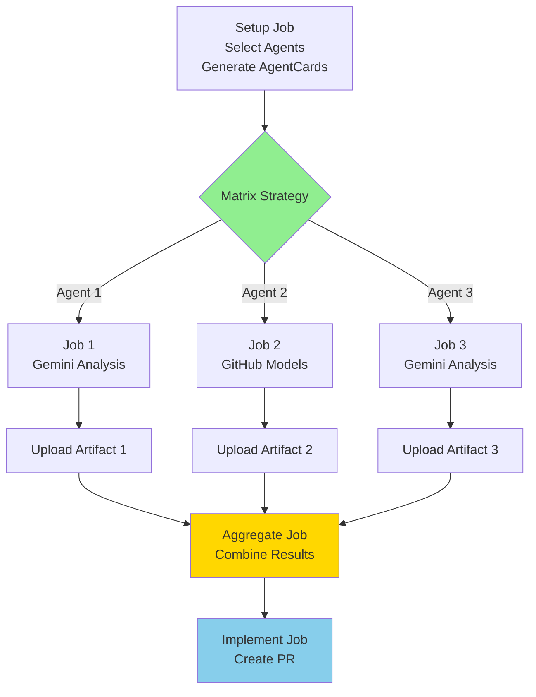
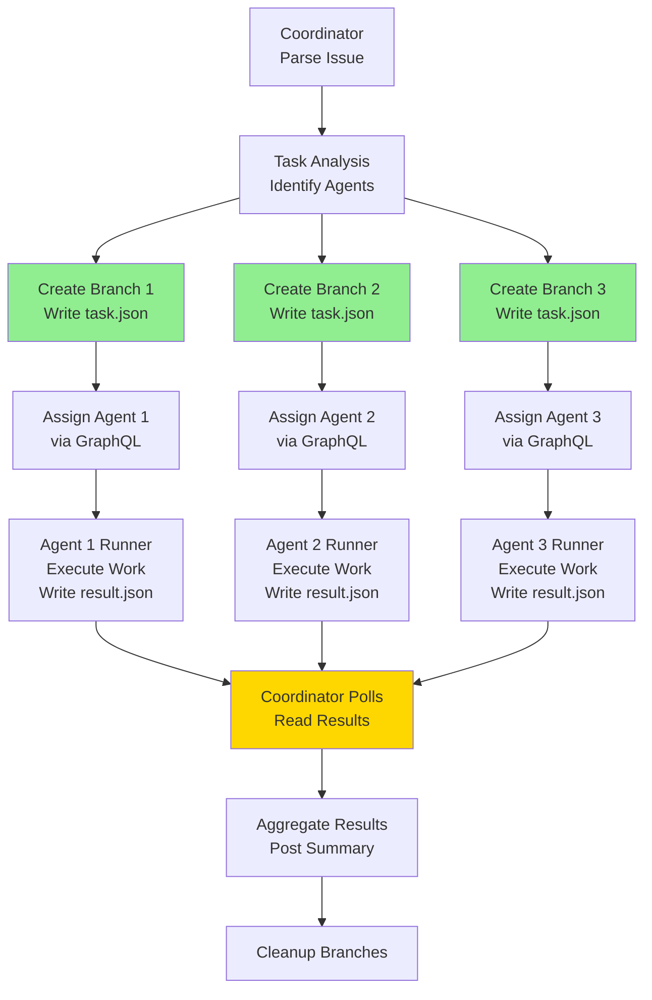
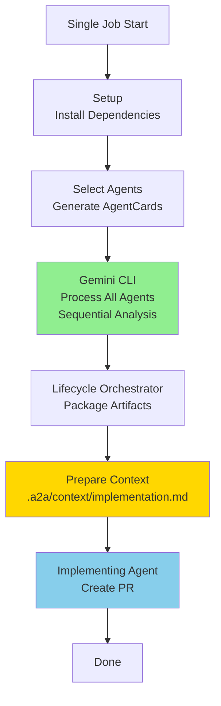
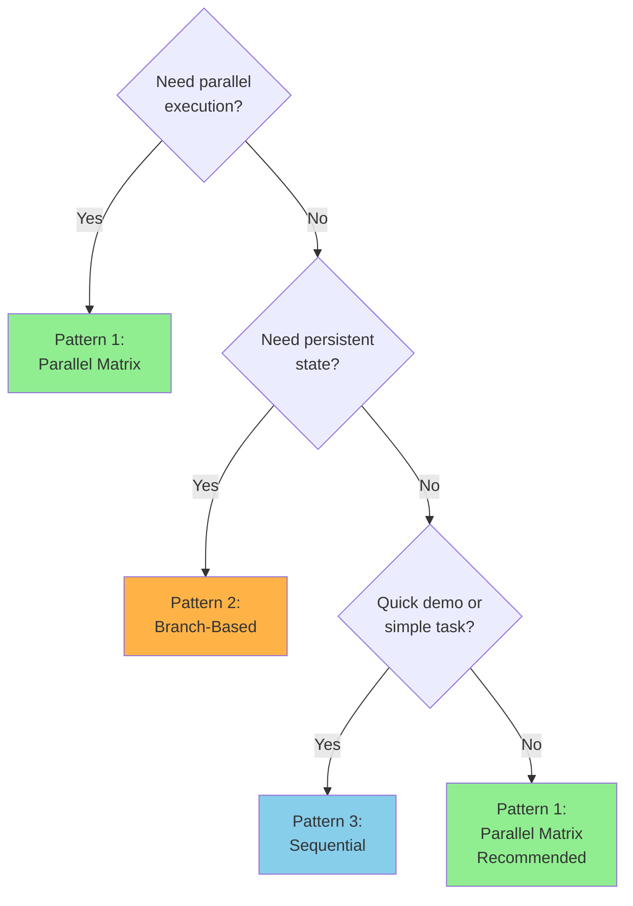
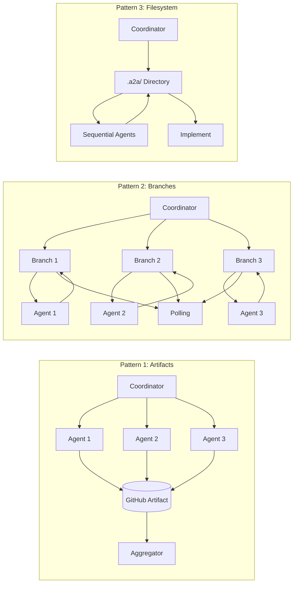

# A2A Orchestration Patterns - Visual Flow

## Pattern 1: Parallel Matrix (FASTEST - 5-10 min)



**Characteristics**:
- ✅ TRUE PARALLELISM (3 jobs run simultaneously)
- ✅ Fastest execution (5-10 minutes)
- ✅ Multi-provider (Gemini + GitHub Models)
- ✅ Clean artifact passing

---

## Pattern 2: Branch-Based Coordination (MOST ROBUST - 10-20 min)



**Characteristics**:
- ✅ Persistent state (branches survive failures)
- ✅ Native Copilot agent assignment
- ✅ Full isolation (separate runners)
- ❌ Sequential execution (polling-based)

---

## Pattern 3: Sequential Multi-Agent (SIMPLEST - 5-10 min)



**Characteristics**:
- ✅ Simplest (all in one job)
- ✅ No cross-job overhead
- ✅ Direct file access
- ❌ No parallelism
- ❌ No isolation

---

## Decision Tree



---

## Performance Comparison

```mermaid
gantt
    title Execution Time Comparison (N=3 agents)
    dateFormat X
    axisFormat %s
    
    section Pattern 1 (Parallel)
    Setup           :p1_setup, 0, 20
    Parallel Exec   :p1_parallel, 20, 180
    Aggregate       :p1_agg, 200, 10
    Implement       :p1_impl, 210, 180
    
    section Pattern 2 (Branch)
    Setup           :p2_setup, 0, 30
    Agent 1         :p2_a1, 30, 300
    Agent 2         :p2_a2, 330, 300
    Agent 3         :p2_a3, 630, 300
    Aggregate       :p2_agg, 930, 10
    
    section Pattern 3 (Sequential)
    Setup           :p3_setup, 0, 15
    Sequential Exec :p3_seq, 15, 180
    Implement       :p3_impl, 195, 180
```



**Legend**:
- Pattern 1: **~6-7 minutes** (fastest due to parallelism)
- Pattern 2: **~15-20 minutes** (sequential, but most robust)
- Pattern 3: **~6-7 minutes** (simple, single job)

---

## Communication Flow Comparison



---

## Use Case Recommendations

| Use Case | Recommended Pattern | Why |
|----------|---------------------|-----|
| 🔥 **Emergency Fix** | Pattern 1 (Parallel) | Fastest turnaround |
| 🔒 **Security Audit** | Pattern 2 (Branch) | Persistent state, isolation |
| 💡 **Quick Triage** | Pattern 1 (Parallel) | Fast parallel analysis |
| 🏗️ **Complex Refactor** | Pattern 2 (Branch) | Long-running, state needed |
| 📝 **Doc Review** | Pattern 3 (Sequential) | Simple, straightforward |
| 🎯 **Demo/Test** | Pattern 3 (Sequential) | Easiest to understand |
| ⚡ **Feature Request** | Pattern 1 (Parallel) | Fast analysis → implement |

---

## Quick Start Commands

### Pattern 1: Fast Parallel
```bash
gh workflow run a2a-parallel-agents.yml \
  -f issue_number=123 \
  -f agent_count=5 \
  -f provider=balanced \
  -f auto_execute=true
```

### Pattern 2: Branch-Based
```bash
gh workflow run copilot-a2a-coordinator.yml \
  -f issue_number=456
```

### Pattern 3: Sequential
```bash
gh workflow run a2a-multi-agent.yml \
  -f issue_number=789 \
  -f agents="engineer-master,organize-guru" \
  -f auto_execute=true
```
