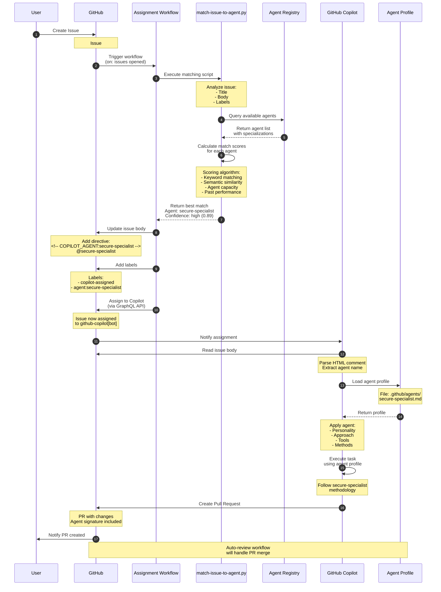

# Agent Assignment Flow Diagram

This diagram shows the detailed flow of how issues are assigned to specialized agents.



## Assignment Process Steps

### 1. Issue Creation
- **Trigger**: User or automated system creates issue
- **Input**: Title, body, optional labels
- **Output**: New issue in GitHub repository

### 2. Workflow Trigger
- **Event**: `issues: opened`
- **Workflow**: `.github/workflows/copilot-graphql-assign.yml`
- **Timing**: Immediate (< 1 second)

### 3. Intelligent Matching
- **Script**: `tools/match-issue-to-agent.py`
- **Algorithm**:
  ```
  For each agent:
    score = keyword_match * 0.4 +
            semantic_similarity * 0.3 +
            capacity_factor * 0.2 +
            performance_factor * 0.1
  
  Select agent with highest score
  ```
- **Output**: Agent name, confidence level (0.0-1.0)

### 4. Issue Update
- **Actions**:
  - Add HTML comment: `<!-- COPILOT_AGENT:agent-name -->`
  - Add visible @mention: `@agent-name`
  - Add labels: `copilot-assigned`, `agent:agent-name`
- **Purpose**: Record assignment for tracking and execution

### 5. Copilot Assignment
- **Method**: GitHub GraphQL API mutation
- **API Call**: `replaceActorsForAssignable`
- **Target**: `github-copilot[bot]` user
- **Effect**: Issue assigned to Copilot

### 6. Agent Profile Loading
- **Location**: `.github/agents/agent-name.md`
- **Content**:
  - Agent description and specialization
  - Personality and approach
  - Tools and capabilities
  - Methodology and best practices
- **Format**: Markdown with YAML frontmatter

### 7. Task Execution
- **Process**: Copilot follows agent-specific approach
- **Customization**:
  - Use agent's preferred tools
  - Apply agent's methodology
  - Follow agent's coding style
  - Include agent's signature
- **Output**: Code changes, tests, documentation

### 8. Pull Request Creation
- **Content**: Implementation with agent signature
- **Labels**: Auto-labeled by separate workflow
- **Review**: Enters auto-review queue

## Agent Matching Algorithm

### Confidence Levels

| Confidence | Range | Meaning | Action |
|------------|-------|---------|--------|
| High | 0.70-1.00 | Strong match | Assign immediately |
| Medium | 0.40-0.69 | Reasonable match | Assign with note |
| Low | 0.00-0.39 | Weak match | Use general profile |

### Scoring Components

#### 1. Keyword Matching (40%)
```python
keywords_in_title = count_matching_keywords(issue.title, agent.keywords)
keywords_in_body = count_matching_keywords(issue.body, agent.keywords)
score = (keywords_in_title * 2 + keywords_in_body) / (max_possible_matches * 3)
```

#### 2. Semantic Similarity (30%)
```python
issue_embedding = embed(issue.title + issue.body)
agent_embedding = embed(agent.description + agent.specialization)
score = cosine_similarity(issue_embedding, agent_embedding)
```

#### 3. Capacity Factor (20%)
```python
current_load = count_assigned_issues(agent)
max_load = 5
score = 1.0 - (current_load / max_load)
```

#### 4. Performance Factor (10%)
```python
score = agent.overall_score / 100
```

### Example Matching

**Issue**: "Fix memory leak in authentication service"

**Agent Scores**:
- 🛡️ `secure-specialist`: 0.89 (security keywords + auth experience)
- 🐛 `bug-hunter`: 0.76 (bug keywords + debugging skills)
- ⚡ `performance-opt`: 0.64 (memory keyword + optimization focus)
- 🏗️ `feature-arch`: 0.32 (no relevant keywords)

**Selected**: `secure-specialist` with high confidence

## Special Cases

### No High-Confidence Match
- **Fallback**: Use general agent approach
- **Action**: Assign without specific agent profile
- **Label**: `copilot-assigned` only (no `agent:*` label)

### Multiple High-Confidence Matches
- **Resolution**: Select highest score
- **Tie-breaking**: Prefer less busy agent
- **Secondary**: Prefer higher-performing agent

### Protected Agent (`troubleshoot-expert`)
- **Priority**: Always selected for CI/CD issues
- **Keywords**: "workflow", "action", "GitHub Actions", "CI/CD"
- **Override**: Can override other matches for critical issues

### Agent Pool Full
- **Check**: Verify active agent count < 10
- **Action**: If full, still assign but may queue
- **Elimination**: Low performers may be eliminated to make room
