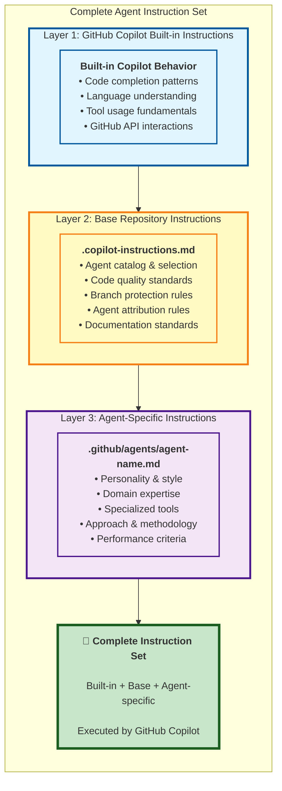
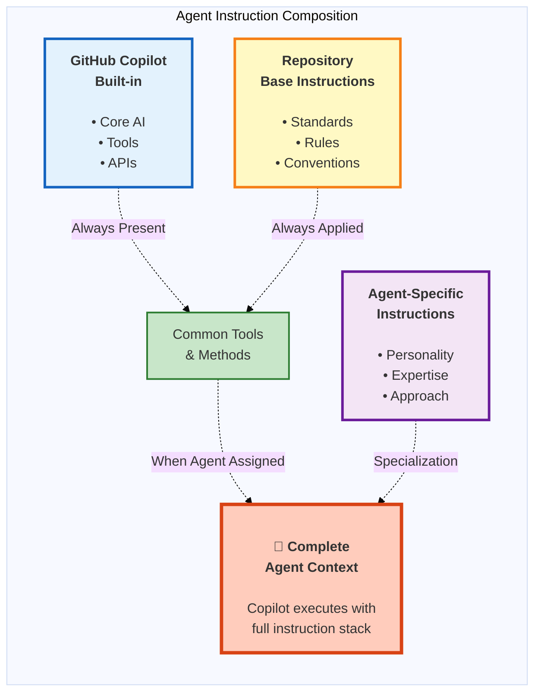
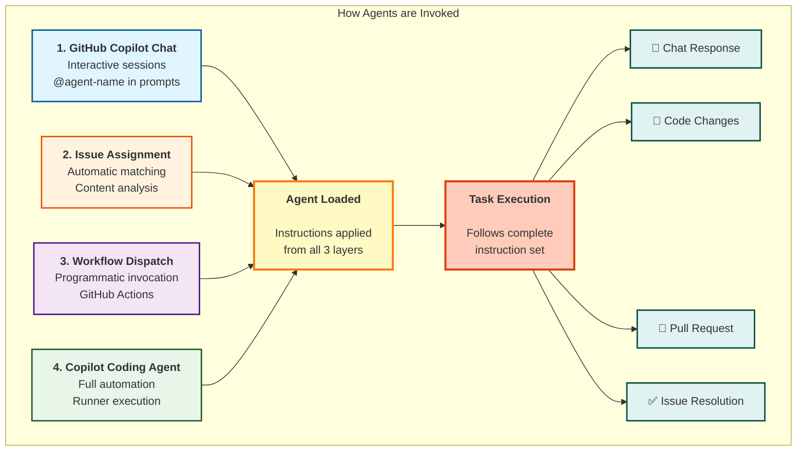
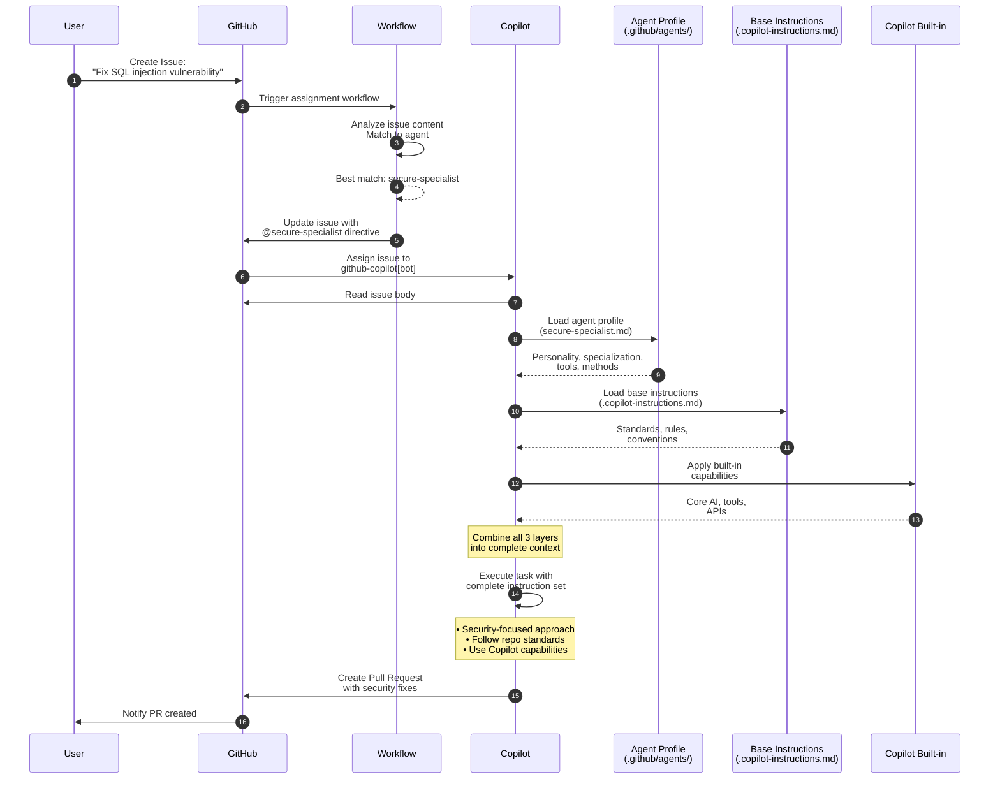

# Agent Instruction Architecture Diagram

This diagram visualizes how the different levels of instructions combine to create the complete instruction set for an agent, and shows the various methods for invoking agents.

## Instruction Layers and Composition

## Instruction Hierarchy as Venn Diagram

## Agent Invocation Methods

## Detailed Instruction Layers

### Layer 1: GitHub Copilot Built-in Instructions

**Provided by**: GitHub Copilot platform  
**Scope**: Universal across all sessions  
**Content**:
- Code completion and generation capabilities
- Understanding of programming languages and frameworks
- Basic tool usage (git, terminal, file operations)
- GitHub API interaction patterns
- Standard software engineering practices

**Cannot be modified by repository**

### Layer 2: Base Repository Instructions

**Location**: `.copilot-instructions.md` (repository root)  
**Scope**: All agent sessions in this repository  
**Content**:
- **Agent System**: Catalog of available agents, selection guidelines, when to delegate
- **Code Quality**: Testing requirements, documentation standards, code style
- **Workflow Rules**: Branch protection, PR-based workflow, no direct pushes to main
- **Agent Communication**: @mention requirements, attribution format, issue updates
- **Project Standards**: Repository structure, file organization, security practices

**Applied to every agent automatically**

### Layer 3: Agent-Specific Instructions

**Location**: `.github/agents/{agent-name}.md`  
**Scope**: Only when specific agent is assigned/invoked  
**Content**:
- **Personality**: Communication style, tone, approach (e.g., "inspired by Grace Hopper")
- **Specialization**: Domain expertise (e.g., security, workflows, documentation)
- **Tools**: Preferred or required tools for the specialization
- **Methodology**: Step-by-step approaches specific to the domain
- **Performance Criteria**: How this agent's work is evaluated

**Applied only when agent is explicitly assigned**

## Example: Complete Instruction Set for `secure-specialist`

When `@secure-specialist` is invoked:

1. **GitHub Copilot Built-in** (Layer 1)
   - Understands code security concepts
   - Can use git, file operations, testing tools
   - Knows GitHub API for creating issues/PRs

2. **Base Instructions** (Layer 2)
   - Must follow branch protection (create PR, not push to main)
   - Must use @secure-specialist in all communications
   - Must write tests (80% coverage minimum)
   - Must update documentation for changes
   - Must handle secrets securely

3. **Agent-Specific** (Layer 3)
   - Personality: "Inspired by Bruce Schneier - vigilant and thoughtful"
   - Specialization: Security, data integrity, access control
   - Approach: Threat modeling, secure defaults, defense in depth
   - Tools: CodeQL, dependency scanning, security linters
   - Methods: Review authentication, validate input, check for common vulnerabilities

**Result**: A security-focused agent that follows all repository conventions while applying specialized security expertise.

## Invocation Flow Example

## Benefits of Layered Architecture

### 🎯 Separation of Concerns
- **Built-in**: Platform capabilities (unchangeable)
- **Base**: Repository-wide standards (consistent)
- **Agent**: Specialized expertise (flexible)

### 🔄 Reusability
- Base instructions apply to all agents (write once, use everywhere)
- Agents can be added/modified without changing base rules
- Consistent standards across all agent work

### 🎨 Customization
- Each agent has unique personality and approach
- Domain-specific methods and tools per agent
- Easy to create new specialized agents

### 📈 Scalability
- Add new agents without modifying existing ones
- Update repository standards for all agents at once
- Clear boundaries between instruction levels

### 🔍 Transparency
- Easy to understand what instructions apply when
- Clear documentation of agent behavior
- Predictable results based on layer composition

---

## Related Documentation

- **[Agent Definitions](./../agents/README.md)** - Full catalog of available agents
- **[Agent Assignment Flow](./agent-assignment-flow.md)** - How issues are matched to agents
- **[Agent Lifecycle](./agent-lifecycle.md)** - Complete agent lifecycle
- **[README: Instruction Architecture](../../README.md#instruction-architecture)** - Overview in main README
- **[.copilot-instructions.md](../../.copilot-instructions.md)** - Base repository instructions

---

*This diagram is part of the Chained autonomous AI ecosystem documentation.*
