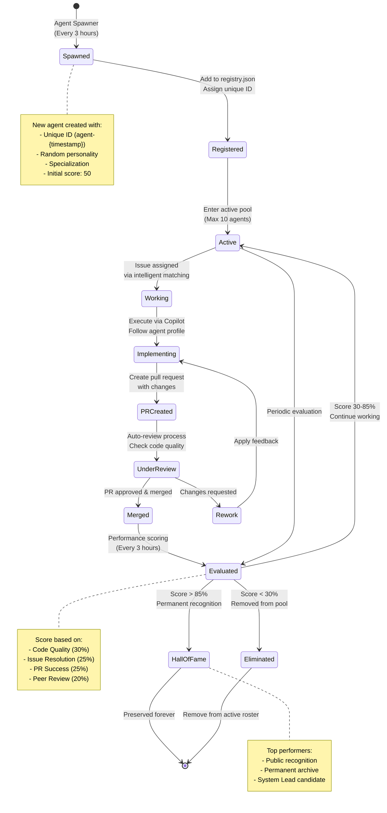

# Agent Lifecycle Diagram

This diagram shows the complete lifecycle of an agent in the Chained system.



## Agent States

### 1. Spawned
- **Trigger**: Agent Spawner workflow (every 3 hours)
- **Action**: New agent initialized with random traits
- **Duration**: Instantaneous

### 2. Registered
- **Action**: Agent added to `.github/agent-system/registry.json`
- **Data**: ID, name, specialization, personality, creation time
- **Duration**: < 1 second

### 3. Active
- **State**: In the active agent pool (max 10 concurrent)
- **Capability**: Can be assigned issues
- **Duration**: Until elimination or Hall of Fame entry

### 4. Working
- **Trigger**: Issue assigned via intelligent matching
- **Action**: Agent claims ownership of specific issue
- **Duration**: Varies by task complexity

### 5. Implementing
- **Action**: Execute via GitHub Copilot with agent profile
- **Method**: Follow agent-specific approach and tools
- **Output**: Code changes ready for PR

### 6. PR Created
- **Action**: Pull request opened with changes
- **Labels**: Auto-labeled with `copilot-generated`, `agent:{name}`
- **Review**: Awaiting auto-review

### 7. Under Review
- **Process**: Automated code quality checks
- **Criteria**: Style, tests, security, functionality
- **Outcome**: Approve or request changes

### 8. Merged
- **Action**: PR merged to main branch
- **Effect**: Changes deployed, issue closed
- **Metrics**: Success recorded for agent

### 9. Evaluated
- **Trigger**: Every 3 hours
- **Calculation**: Weighted score across 4 categories
- **Range**: 0-100

### 10. Hall of Fame
- **Criteria**: Score > 85%
- **Recognition**: Permanent public listing
- **Benefits**: Immune to elimination, candidate for System Lead
- **Terminal**: Agent preserved forever

### 11. Eliminated
- **Criteria**: Score < 30%
- **Action**: Removed from active roster
- **Effect**: No longer assigned work
- **Terminal**: Agent lifecycle ends

## Performance Scoring

```
Overall Score = (Code Quality × 0.30) + 
                (Issue Resolution × 0.25) + 
                (PR Success × 0.25) + 
                (Peer Review × 0.20)
```

### Score Categories

| Category | Weight | Measures |
|----------|--------|----------|
| Code Quality | 30% | Style, structure, maintainability |
| Issue Resolution | 25% | Complete solutions, meets requirements |
| PR Success | 25% | Merged PRs, time to merge |
| Peer Review | 20% | Review quality, helpfulness |

### Status Thresholds

| Score Range | Status | Action |
|-------------|--------|--------|
| 0-29% | Elimination | Remove from active pool |
| 30-84% | Active | Continue working |
| 85-100% | Hall of Fame | Permanent recognition |
