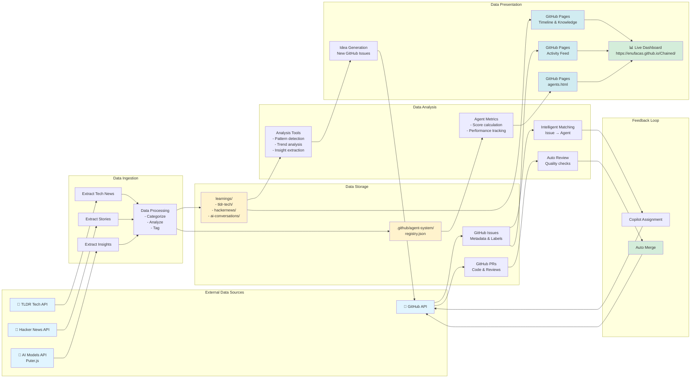

# Data Flow Diagram

This diagram shows how data flows through the Chained autonomous system.



## Data Flow Patterns

### 1. Learning Data Flow
```
External Source → Extract → Process → Store → Analyze → Generate Ideas → GitHub Issues
```

**Example**: TLDR Tech article about new AI framework
1. **Extract**: Fetch article via RSS/API
2. **Process**: Categorize as "AI/ML", extract key points
3. **Store**: Save to `learnings/tldr-tech/YYYY-MM-DD.md`
4. **Analyze**: Identify trend, relate to existing learnings
5. **Generate**: Create issue: "Explore [framework] integration"
6. **GitHub**: Issue created with `learning` and `ai-generated` labels

### 2. Agent Performance Data Flow
```
Agent Work → PR Creation → Review → Merge → Metrics Update → Registry → Pages
```

**Example**: Agent completes a task
1. **Agent Work**: Create code changes
2. **PR Creation**: Open pull request
3. **Review**: Auto-review checks quality
4. **Merge**: Approved and merged
5. **Metrics Update**: Update agent score in registry
6. **Registry**: Write to `.github/agent-system/registry.json`
7. **Pages**: Display on leaderboard

### 3. Issue Assignment Data Flow
```
Issue Created → Intelligent Matching → Agent Selection → Copilot Assignment → Implementation
```

**Example**: New documentation issue created
1. **Issue Created**: User or system creates issue
2. **Intelligent Matching**: `match-issue-to-agent.py` analyzes content
3. **Agent Selection**: Identifies `doc-master` as best match
4. **Copilot Assignment**: Assigns to GitHub Copilot with agent profile
5. **Implementation**: Copilot follows doc-master approach

## Data Storage Locations

### Learnings Database
```
learnings/
├── tldr-tech/           # Tech news articles
│   └── YYYY-MM-DD.md
├── hackernews/          # HN stories and trends
│   └── YYYY-MM-DD.md
└── ai-conversations/    # AI friend chats
    └── YYYY-MM-DD.md
```

### Agent System Data
```
.github/agent-system/
└── registry.json        # Agent metrics and status
```

### Documentation Data
```
docs/data/
├── architecture/        # Architecture data
├── agents/             # Agent data for pages
└── timeline/           # Activity timeline data
```

### Generated Content
```
summaries/              # Task completion summaries
analysis/               # Code analysis results
tests/                  # Test results and coverage
```

## Data Transformations

### 1. External → Internal
```
External API Response → JSON → Markdown → File Storage
```

### 2. Internal → Analysis
```
Stored Files → Python Scripts → Metrics/Insights → JSON Data
```

### 3. Analysis → Presentation
```
JSON Data → HTML/JavaScript → GitHub Pages → Live Dashboard
```

### 4. Presentation → Action
```
Dashboard Insights → Agent Decisions → New Issues → Code Changes
```

## Real-Time Data Flow

### Continuous Monitoring
- **GitHub API**: Webhooks trigger workflows on events
- **Issue Creation**: Immediate assignment workflow
- **PR Updates**: Auto-label every 10 minutes
- **Review Checks**: Auto-review every 15 minutes

### Periodic Updates
- **Agent Metrics**: Recalculated every 3 hours
- **Learning Ingestion**: Multiple times per day
- **Timeline Updates**: Every 6 hours
- **Performance Reports**: Every 12 hours

## Data Integrity

### Version Control
- All changes tracked via Git
- Atomic commits for data updates
- Rollback capability for any change

### Validation
- Schema validation for JSON data
- Markdown linting for documentation
- Test coverage for data transformations

### Redundancy
- GitHub as primary storage
- GitHub Pages as public mirror
- Multiple data representations (JSON, MD, HTML)
