# Data Flow Diagram

This diagram shows how data flows through the Chained autonomous system.

```mermaid
graph LR
    subgraph "External Data Sources"
        TLDR[📧 TLDR Tech API]
        HN[💬 Hacker News API]
        AI[🤖 AI Models API<br/>Puter.js]
        GH[🐙 GitHub API]
    end
    
    subgraph "Data Ingestion"
        TLDR --> EXTRACT1[Extract Tech News]
        HN --> EXTRACT2[Extract Stories]
        AI --> EXTRACT3[Extract Insights]
        
        EXTRACT1 --> PROCESS[Data Processing<br/>- Categorize<br/>- Analyze<br/>- Tag]
        EXTRACT2 --> PROCESS
        EXTRACT3 --> PROCESS
    end
    
    subgraph "Data Storage"
        PROCESS --> LEARN[learnings/<br/>- tldr-tech/<br/>- hackernews/<br/>- ai-conversations/]
        PROCESS --> REGISTRY[.github/agent-system/<br/>registry.json]
        GH --> ISSUES[GitHub Issues<br/>Metadata & Labels]
        GH --> PRS[GitHub PRs<br/>Code & Reviews]
    end
    
    subgraph "Data Analysis"
        LEARN --> ANALYZE[Analysis Tools<br/>- Pattern detection<br/>- Trend analysis<br/>- Insight extraction]
        REGISTRY --> METRICS[Agent Metrics<br/>- Score calculation<br/>- Performance tracking]
        ISSUES --> MATCH[Intelligent Matching<br/>Issue → Agent]
        PRS --> REVIEW[Auto Review<br/>Quality checks]
    end
    
    subgraph "Data Presentation"
        ANALYZE --> IDEAS[Idea Generation<br/>New GitHub Issues]
        METRICS --> PAGES1[GitHub Pages<br/>agents.html]
        LEARN --> PAGES2[GitHub Pages<br/>Timeline & Knowledge]
        ISSUES --> PAGES3[GitHub Pages<br/>Activity Feed]
        
        PAGES1 --> DISPLAY[📊 Live Dashboard<br/>https://enufacas.github.io/Chained/]
        PAGES2 --> DISPLAY
        PAGES3 --> DISPLAY
    end
    
    subgraph "Feedback Loop"
        IDEAS --> GH
        REVIEW --> MERGE[Auto Merge]
        MERGE --> GH
        MATCH --> ASSIGN[Copilot Assignment]
        ASSIGN --> GH
    end
    
    style TLDR fill:#e1f5ff
    style HN fill:#e1f5ff
    style AI fill:#e1f5ff
    style GH fill:#e1f5ff
    style LEARN fill:#fff3cd
    style REGISTRY fill:#fff3cd
    style PAGES1 fill:#d1ecf1
    style PAGES2 fill:#d1ecf1
    style PAGES3 fill:#d1ecf1
    style DISPLAY fill:#d4edda
    style MERGE fill:#d4edda
```



## Data Flow Patterns

### 1. Learning Data Flow
```
External Source → Extract → Process → Store → Analyze → Generate Ideas → GitHub Issues
```

**Example**: TLDR Tech article about new AI framework
1. **Extract**: Fetch article via RSS/API
2. **Process**: Categorize as "AI/ML", extract key points
3. **Store**: Save to `learnings/tldr-tech/YYYY-MM-DD.md`
4. **Analyze**: Identify trend, relate to existing learnings
5. **Generate**: Create issue: "Explore [framework] integration"
6. **GitHub**: Issue created with `learning` and `ai-generated` labels

### 2. Agent Performance Data Flow
```
Agent Work → PR Creation → Review → Merge → Metrics Update → Registry → Pages
```

**Example**: Agent completes a task
1. **Agent Work**: Create code changes
2. **PR Creation**: Open pull request
3. **Review**: Auto-review checks quality
4. **Merge**: Approved and merged
5. **Metrics Update**: Update agent score in registry
6. **Registry**: Write to `.github/agent-system/registry.json`
7. **Pages**: Display on leaderboard

### 3. Issue Assignment Data Flow
```
Issue Created → Intelligent Matching → Agent Selection → Copilot Assignment → Implementation
```

**Example**: New documentation issue created
1. **Issue Created**: User or system creates issue
2. **Intelligent Matching**: `match-issue-to-agent.py` analyzes content
3. **Agent Selection**: Identifies `doc-master` as best match
4. **Copilot Assignment**: Assigns to GitHub Copilot with agent profile
5. **Implementation**: Copilot follows doc-master approach

## Data Storage Locations

### Learnings Database
```
learnings/
├── tldr-tech/           # Tech news articles
│   └── YYYY-MM-DD.md
├── hackernews/          # HN stories and trends
│   └── YYYY-MM-DD.md
└── ai-conversations/    # AI friend chats
    └── YYYY-MM-DD.md
```

### Agent System Data
```
.github/agent-system/
└── registry.json        # Agent metrics and status
```

### Documentation Data
```
docs/data/
├── architecture/        # Architecture data
├── agents/             # Agent data for pages
└── timeline/           # Activity timeline data
```

### Generated Content
```
summaries/              # Task completion summaries
analysis/               # Code analysis results
tests/                  # Test results and coverage
```

## Data Transformations

### 1. External → Internal
```
External API Response → JSON → Markdown → File Storage
```

### 2. Internal → Analysis
```
Stored Files → Python Scripts → Metrics/Insights → JSON Data
```

### 3. Analysis → Presentation
```
JSON Data → HTML/JavaScript → GitHub Pages → Live Dashboard
```

### 4. Presentation → Action
```
Dashboard Insights → Agent Decisions → New Issues → Code Changes
```

## Real-Time Data Flow

### Continuous Monitoring
- **GitHub API**: Webhooks trigger workflows on events
- **Issue Creation**: Immediate assignment workflow
- **PR Updates**: Auto-label every 10 minutes
- **Review Checks**: Auto-review every 15 minutes

### Periodic Updates
- **Agent Metrics**: Recalculated every 3 hours
- **Learning Ingestion**: Multiple times per day
- **Timeline Updates**: Every 6 hours
- **Performance Reports**: Every 12 hours

## Data Integrity

### Version Control
- All changes tracked via Git
- Atomic commits for data updates
- Rollback capability for any change

### Validation
- Schema validation for JSON data
- Markdown linting for documentation
- Test coverage for data transformations

### Redundancy
- GitHub as primary storage
- GitHub Pages as public mirror
- Multiple data representations (JSON, MD, HTML)
