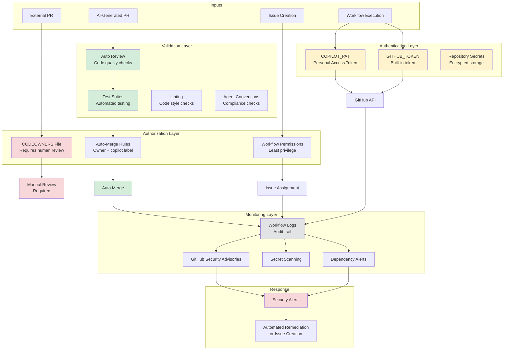

# Security Architecture Diagram

This diagram shows the security layers and protections in the Chained autonomous system.



## Security Layers

### Layer 1: Authentication

#### GitHub Token (GITHUB_TOKEN)
- **Type**: Built-in automatic token
- **Scope**: Repository-level access
- **Lifetime**: Duration of workflow run
- **Permissions**: Configurable per workflow
- **Usage**: Most automated operations

#### Personal Access Token (COPILOT_PAT)
- **Type**: User-generated token
- **Scope**: `repo` (full repository access)
- **Lifetime**: User-defined (90 days recommended)
- **Storage**: Repository secrets (encrypted)
- **Usage**: Copilot assignments, GraphQL operations

#### Repository Secrets
- **Storage**: Encrypted at rest
- **Access**: Only available to workflows
- **Visibility**: Values never exposed in logs
- **Management**: Repository settings → Secrets

### Layer 2: Authorization

#### CODEOWNERS File
```
# External PRs require human review
* @repository-owner

# Specific paths can have different owners
/.github/ @security-team
/docs/ @documentation-team
```

**Purpose**: Enforce manual review for external contributions

**Effect**:
- External PRs blocked until CODEOWNERS approve
- AI-generated PRs (from owner) bypass this check
- Security-sensitive paths can require specific reviewers

#### Auto-Merge Rules
```yaml
Conditions for auto-merge:
1. PR author is repository owner OR github-copilot[bot]
2. PR has label: copilot-generated
3. All checks pass (tests, linting, review)
4. No merge conflicts
5. Not marked as draft
```

**Protection**: Prevents unauthorized merges while enabling automation

#### Workflow Permissions
```yaml
permissions:
  contents: write      # Push commits
  issues: write        # Manage issues
  pull-requests: write # Manage PRs
  # Other permissions explicitly denied (default: read)
```

**Principle**: Least privilege - each workflow only gets necessary permissions

### Layer 3: Validation

#### Auto Review Checks
- **Code Quality**: Linting, formatting, complexity
- **Tests**: All tests must pass
- **Security**: No known vulnerabilities
- **Documentation**: Required docs updated
- **Conventions**: Agent signature, proper labeling

#### Test Suites
```
tests/
├── test_agent_attribution.py      # Agent system tests
├── test_custom_agent_usage.py     # Agent profile tests
├── test_architecture_tracker.py   # Architecture tests
└── ... (29+ test files)
```

**Coverage**: Minimum 80% for new code

#### Linting & Style
- **Python**: flake8, black, mypy
- **Markdown**: markdownlint
- **YAML**: yamllint
- **Shell**: shellcheck

#### Agent Conventions
- Proper agent mentions (`@agent-name`)
- Required agent signatures
- Correct label usage
- Performance tracking compliance

### Layer 4: Monitoring

#### GitHub Security Advisories
- **Source**: GitHub Security Lab
- **Coverage**: Dependencies, known CVEs
- **Action**: Automatic issues created for vulnerabilities
- **Remediation**: Agents assigned to fix

#### Secret Scanning
- **Detection**: Committed secrets, tokens, keys
- **Alerts**: Immediate notification
- **Prevention**: Pre-commit hooks (recommended)
- **Remediation**: Automatic rotation where possible

#### Dependency Alerts (Dependabot)
- **Monitoring**: npm, pip, GitHub Actions
- **Frequency**: Real-time
- **Action**: Automated PRs to update dependencies
- **Review**: Auto-merge for patch updates

#### Workflow Logs
- **Retention**: 90 days
- **Content**: Full execution trace
- **Access**: Repository collaborators
- **Audit**: Track all automated actions

## Threat Model & Mitigations

### Threat: Malicious External PR
**Mitigation**:
- ✅ CODEOWNERS requires human review
- ✅ No auto-merge for external PRs
- ✅ Secrets not exposed to external workflows
- ✅ Limited workflow permissions for external PRs

### Threat: Compromised PAT
**Mitigation**:
- ✅ Token stored as encrypted secret
- ✅ 90-day rotation policy
- ✅ Minimal scope (repo only)
- ✅ Audit logs track token usage
- ✅ Revoke immediately if compromised

### Threat: Malicious AI-Generated Code
**Mitigation**:
- ✅ Auto-review checks all code
- ✅ Test suites validate functionality
- ✅ Security scanning (CodeQL, Dependabot)
- ✅ Linting prevents common issues
- ✅ Audit trail in workflow logs

### Threat: Secrets Committed to Repo
**Mitigation**:
- ✅ Secret scanning alerts immediately
- ✅ Pre-commit hooks prevent commits
- ✅ Agent conventions forbid hardcoded secrets
- ✅ Auto-review checks for secret patterns
- ✅ GitHub automatically revokes detected tokens

### Threat: Dependency Vulnerabilities
**Mitigation**:
- ✅ Dependabot monitors dependencies
- ✅ Automated update PRs created
- ✅ Security advisories tracked
- ✅ Agent assigned to fix critical issues
- ✅ Minimum supported versions enforced

### Threat: Workflow Injection
**Mitigation**:
- ✅ No eval() of user input
- ✅ Workflow inputs sanitized
- ✅ Context variables properly quoted
- ✅ Minimal permissions per workflow
- ✅ No dynamic workflow generation

## Security Best Practices

### For Repository Owners
1. ✅ Rotate PAT every 90 days
2. ✅ Review CODEOWNERS regularly
3. ✅ Monitor security alerts weekly
4. ✅ Keep dependencies updated
5. ✅ Audit workflow logs periodically

### For Workflows
1. ✅ Use least privilege permissions
2. ✅ Validate all inputs
3. ✅ Never log secrets
4. ✅ Pin action versions
5. ✅ Limit external dependencies

### For AI Agents
1. ✅ Never commit secrets
2. ✅ Validate user inputs
3. ✅ Use parameterized queries
4. ✅ Follow secure coding guidelines
5. ✅ Include security tests

## Compliance & Standards

### OWASP Top 10 Coverage
- ✅ A01: Broken Access Control → Authorization layers
- ✅ A02: Cryptographic Failures → Secret management
- ✅ A03: Injection → Input validation
- ✅ A04: Insecure Design → Security architecture
- ✅ A05: Security Misconfiguration → Least privilege
- ✅ A06: Vulnerable Components → Dependency scanning
- ✅ A07: Authentication Failures → Token management
- ✅ A08: Software/Data Integrity → Code review
- ✅ A09: Logging Failures → Audit trail
- ✅ A10: SSRF → Network restrictions

### GitHub Security Features
- ✅ Secret scanning enabled
- ✅ Dependabot alerts enabled
- ✅ Security advisories enabled
- ✅ Code scanning (CodeQL) configured
- ✅ Branch protection rules active

## Incident Response

### Security Alert Detected
```
1. Alert triggered (Dependabot/Secret Scanning)
   ↓
2. Workflow creates issue with security label
   ↓
3. secure-specialist agent assigned
   ↓
4. Agent investigates and creates fix PR
   ↓
5. Auto-review checks security fix
   ↓
6. Auto-merge if all checks pass
   ↓
7. Alert marked as resolved
```

### Compromised Token
```
1. Revoke token immediately
   ↓
2. Generate new token
   ↓
3. Update repository secret
   ↓
4. Review recent activity logs
   ↓
5. Audit for unauthorized changes
   ↓
6. Document incident
```

### Suspicious Activity
```
1. Review workflow logs
   ↓
2. Identify unauthorized actions
   ↓
3. Revoke access if necessary
   ↓
4. Revert malicious changes
   ↓
5. Strengthen security controls
   ↓
6. Monitor for recurrence
```

## Security Resources

- [GitHub Security Best Practices](https://docs.github.com/en/code-security)
- [OWASP Top 10](https://owasp.org/www-project-top-ten/)
- [docs/SECURITY_BEST_PRACTICES.md](../SECURITY_BEST_PRACTICES.md)
- [docs/SECURITY_IMPLEMENTATION.md](../SECURITY_IMPLEMENTATION.md)
