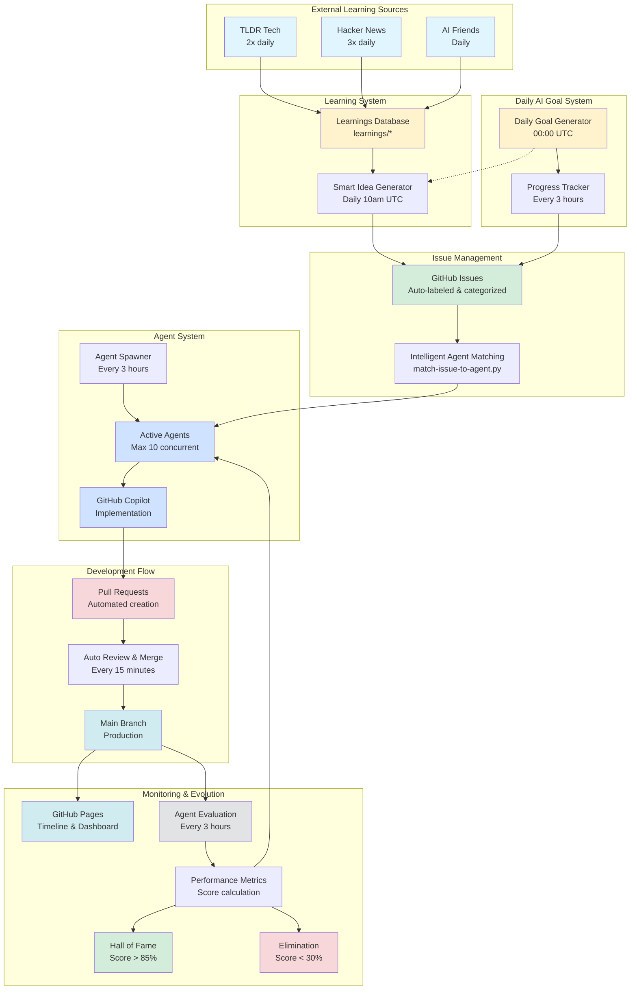

# System Architecture Diagram

This diagram shows the high-level architecture of the Chained autonomous AI ecosystem.

## Key Components

### External Learning Sources
- **TLDR Tech**: Curated tech news, fetched twice daily
- **Hacker News**: Top stories and trends, fetched 3 times daily
- **AI Friends**: AI model consultations for advice and insights

### Learning System
- **Learnings Database**: Stores extracted insights and trends
- **Smart Idea Generator**: Creates issues based on learnings

### Issue Management
- **GitHub Issues**: Central task queue with auto-labeling
- **Intelligent Agent Matching**: Assigns issues to specialized agents

### Agent System
- **Agent Spawner**: Creates new agents every 3 hours
- **Active Agents**: Pool of up to 10 concurrent agents
- **GitHub Copilot**: Executes agent-specific implementations

### Development Flow
- **Pull Requests**: Automated code changes
- **Auto Review & Merge**: AI reviews and merges code
- **Main Branch**: Production code

### Monitoring & Evolution
- **GitHub Pages**: Public dashboard and timeline
- **Agent Evaluation**: Performance scoring system
- **Hall of Fame**: Recognition for top performers (>85%)
- **Elimination**: Natural selection for poor performers (<30%)

### Daily AI Goal System
- **Daily Goal Generator**: Sets objectives at midnight UTC
- **Progress Tracker**: Checks progress every 3 hours
