# 🔧 Troubleshooting Flow Diagram

This diagram shows the systematic approach to troubleshooting issues in the Chained autonomous AI ecosystem.

## Complete Troubleshooting Decision Tree

```mermaid
graph TD
    Start[🚨 Problem Detected] --> Type{What's the symptom?}
    
    Type -->|Nothing works| Critical[🔴 Critical State]
    Type -->|Some failures| Degraded[🟡 Degraded State]
    Type -->|Specific issue| Targeted[🎯 Targeted Investigation]
    
    Critical --> Emergency[Run Emergency Diagnostic]
    Emergency --> CheckGitHub{GitHub Status OK?}
    CheckGitHub -->|No| Wait[Wait for GitHub]
    CheckGitHub -->|Yes| Kickstart[Run kickoff-system.sh]
    
    Degraded --> HealthCheck[Run quick-health-check.sh]
    HealthCheck --> Analyze{What's failing?}
    
    Targeted --> IssueType{Issue Type?}
    
    Analyze -->|Workflows| WorkflowIssues
    Analyze -->|Copilot| CopilotIssues  
    Analyze -->|Agents| AgentIssues
    Analyze -->|Pages| PagesIssues
    
    IssueType -->|Copilot| CopilotIssues
    IssueType -->|Workflow| WorkflowIssues
    IssueType -->|Agent| AgentIssues
    IssueType -->|Pages| PagesIssues
    IssueType -->|Learning| LearningIssues
    IssueType -->|Performance| PerfIssues
    
    CopilotIssues[🤖 Copilot Issues] --> CopilotCheck{Check COPILOT_PAT}
    CopilotCheck -->|Missing| AddPAT[Add PAT Secret]
    CopilotCheck -->|Present| IssueQuality{Issue has context?}
    IssueQuality -->|No| ImproveIssue[Add detailed context]
    IssueQuality -->|Yes| CheckService{Service status?}
    CheckService -->|Down| WaitService[Wait for Copilot]
    CheckService -->|Up| CheckRepo{Repo size OK?}
    CheckRepo -->|Too large| AddIgnore[Add .copilotignore]
    CheckRepo -->|OK| InvestigateMore[Check logs]
    
    WorkflowIssues[⚙️ Workflow Issues] --> WFType{Failure type?}
    WFType -->|Not running| Schedule[Check schedule/cron]
    WFType -->|Permissions| AddPerms[Add permissions]
    WFType -->|Failures| CheckLogs[Review logs]
    Schedule --> EnableWF[Enable workflow]
    EnableWF --> TestManual[Test manually]
    
    AgentIssues[🤖 Agent Issues] --> AgentCheck{Check registry.json}
    AgentCheck -->|Invalid JSON| RestoreRegistry[Restore from git]
    AgentCheck -->|Valid| ScoreCheck{Zero scores?}
    ScoreCheck -->|Yes| AgentAge{Agent age < 3h?}
    AgentAge -->|Yes| WaitEval[Wait for evaluator]
    AgentAge -->|No| CheckEval[Check evaluator workflow]
    
    PagesIssues[🌐 Pages Issues] --> PagesEnabled{Pages enabled?}
    PagesEnabled -->|No| EnablePages[Enable in Settings]
    PagesEnabled -->|Yes| DataFresh{Data files fresh?}
    DataFresh -->|No| UpdateData[Run timeline-updater]
    DataFresh -->|Yes| ClearCache[Hard refresh browser]
    
    LearningIssues[🧠 Learning Issues] --> APICheck{API rate limit?}
    APICheck -->|Yes| ReduceFreq[Reduce workflow frequency]
    APICheck -->|No| PermCheck{Permissions OK?}
    PermCheck -->|No| AddWritePerms[Add contents: write]
    PermCheck -->|Yes| TestAPI[Test API endpoint]
    
    PerfIssues[📊 Performance Issues] --> PerfType{Issue type?}
    PerfType -->|Slow workflows| OptimizeWF[Optimize workflow]
    PerfType -->|High failures| AnalyzePatterns[Analyze failure patterns]
    PerfType -->|Rate limits| ReduceLoad[Reduce API calls]
    
    %% Resolution paths
    AddPAT --> Verify[Verify & Test]
    ImproveIssue --> Verify
    AddIgnore --> Verify
    TestManual --> Verify
    RestoreRegistry --> Verify
    UpdateData --> Verify
    ReduceFreq --> Verify
    OptimizeWF --> Verify
    
    Verify --> Success{Fixed?}
    Success -->|Yes| Document[📝 Document solution]
    Success -->|No| AdvancedDiag[Use advanced diagnostics]
    
    Document --> Complete[✅ Complete]
    AdvancedDiag --> Timeline[Timeline analysis]
    Timeline --> StateReconstruct[State reconstruction]
    StateReconstruct --> GetHelp[Create support issue]
    
    style Start fill:#ff6b6b
    style Critical fill:#ff6b6b
    style Degraded fill:#ffd93d
    style Complete fill:#6bcf7f
    style Document fill:#6bcf7f
```

## Quick Decision Matrix

Use this matrix for fast issue categorization:

## Diagnostic Tool Selection

Choose the right tool for your investigation:

## 5-Step Diagnostic Method

The systematic approach used throughout the guide:

```mermaid
graph LR
    Step1[1️⃣ OBSERVE] -->|Gather data| Step2[2️⃣ HYPOTHESIZE]
    Step2 -->|List causes| Step3[3️⃣ TEST]
    Step3 -->|Run diagnostics| Step4[4️⃣ FIX]
    Step4 -->|Apply solution| Step5[5️⃣ VERIFY]
    Step5 -->|Check results| Decision{Fixed?}
    
    Decision -->|No| Step2
    Decision -->|Yes| Complete[Document & Close]
    
    style Step1 fill:#e3f2fd
    style Step2 fill:#fff9c4
    style Step3 fill:#f3e5f5
    style Step4 fill:#e0f2f1
    style Step5 fill:#fce4ec
    style Complete fill:#6bcf7f
```

### Step Details

1. **OBSERVE** 👀
   - What's the symptom?
   - When did it start?
   - What changed recently?
   - Are there patterns?

2. **HYPOTHESIZE** 🤔
   - List 3 possible causes
   - Order by likelihood
   - Consider recent changes
   - Check similar past issues

3. **TEST** 🔬
   - Check logs
   - Run diagnostics
   - Isolate variables
   - Test hypotheses in order

4. **FIX** 🔧
   - Apply targeted solution
   - Not shotgun approach
   - One change at a time
   - Document what you do

5. **VERIFY** ✅
   - Confirm fix works
   - Check side effects
   - Run full health check
   - Document for future

## System State Transitions

Understanding how the system moves between states:

```mermaid
stateDiagram-v2
    [*] --> Healthy: System initialized
    Healthy --> Degraded: Some workflows fail
    Degraded --> Healthy: Issues resolved
    Degraded --> Critical: Multiple failures
    Critical --> Degraded: Emergency fixes
    Degraded --> Healthy: Full recovery
    Critical --> Healthy: System restart
    
    Healthy: ✅ HEALTHY\nAll systems operational\nWorkflows running\nCopilot responsive
    Degraded: ⚠️ DEGRADED\nSome failures\nDelayed responses\nRate limits approached
    Critical: 🔴 CRITICAL\nMultiple failures\nNo new issues\nCopilot not responding
```

## Common Issue Categories

Distribution of issues by category (based on real data):

## Resolution Time by Issue Type

Average time to resolve each issue category:

---

## How to Use These Diagrams

1. **Start with the Complete Decision Tree** for systematic troubleshooting
2. **Use Quick Decision Matrix** when you know the symptom category
3. **Follow 5-Step Method** for complex or unknown issues
4. **Reference Tool Selection** to choose the right diagnostic
5. **Understand State Transitions** to assess system health

## Related Documentation

- **[COMPREHENSIVE_TROUBLESHOOTING_GUIDE.md](../COMPREHENSIVE_TROUBLESHOOTING_GUIDE.md)** - Full guide with detailed solutions
- **[TROUBLESHOOTING.md](../TROUBLESHOOTING.md)** - Quick reference guide
- **[PIPELINE_TROUBLESHOOTING.md](../PIPELINE_TROUBLESHOOTING.md)** - Pipeline-specific issues

---

*Created by **@clarify-champion** - Making troubleshooting as clear as starlight* ✨
