# Workflow Timeline Diagram

This diagram shows the 24-hour workflow schedule in the Chained autonomous system.

```mermaid
gantt
    title Chained 24-Hour Workflow Schedule
    dateFormat HH:mm
    axisFormat %H:%M
    
    section Daily Goals
    Daily Goal Generator           :milestone, m1, 00:00, 0m
    Progress Check                 :milestone, 03:00, 0m
    Progress Check                 :milestone, 06:00, 0m
    Progress Check                 :milestone, 09:00, 0m
    Progress Check                 :milestone, 12:00, 0m
    Progress Check                 :milestone, 15:00, 0m
    Progress Check                 :milestone, 18:00, 0m
    Progress Check                 :milestone, 21:00, 0m
    
    section Learning
    Learn: Hacker News             :active, 07:00, 30m
    Learn: TLDR Tech               :active, 08:00, 30m
    AI Friend Daily Chat           :active, 09:00, 30m
    Learn: Hacker News             :active, 13:00, 30m
    Learn: Hacker News             :active, 19:00, 30m
    Learn: TLDR Tech               :active, 20:00, 30m
    
    section Idea Generation
    Smart Idea Generator           :milestone, m2, 10:00, 0m
    
    section Agent Management
    Agent Spawner                  :milestone, 00:00, 0m
    Agent Spawner                  :milestone, 03:00, 0m
    Agent Spawner                  :milestone, 06:00, 0m
    Agent Spawner                  :milestone, 09:00, 0m
    Agent Spawner                  :milestone, 12:00, 0m
    Agent Spawner                  :milestone, 15:00, 0m
    Agent Spawner                  :milestone, 18:00, 0m
    Agent Spawner                  :milestone, 21:00, 0m
    Agent Evaluation               :crit, 00:00, 15m
    Agent Evaluation               :crit, 12:00, 15m
    
    section Continuous
    Issue Auto-Assign (on create)  :done, 00:00, 24h
    Auto Label PRs (every 10m)     :done, 00:00, 24h
    Auto Review (every 15m)        :done, 00:00, 24h
    Issue Auto-Close (every 30m)   :done, 00:00, 24h
    
    section Reporting
    Progress Tracker               :active, 00:00, 30m
    Progress Tracker               :active, 12:00, 30m
    Timeline Update                :active, 04:00, 20m
    Timeline Update                :active, 10:00, 20m
    Timeline Update                :active, 16:00, 20m
    Timeline Update                :active, 22:00, 20m
```

## Workflow Schedule Details

### Midnight (00:00 UTC)
- 🎯 **Daily AI Goal Generator**: Sets the day's objective
- 🤖 **Agent Spawner**: Creates new agent
- 📊 **Agent Evaluation**: Scores all agents
- 📈 **Progress Tracker**: First daily report

### Early Morning (03:00-06:00 UTC)
- 🤖 **Agent Spawner**: Creates new agent (03:00, 06:00)
- ⏰ **Progress Check**: Checks daily goal progress (03:00, 06:00)
- 📄 **Timeline Update**: Updates GitHub Pages (04:00)

### Morning (07:00-10:00 UTC)
- 📰 **Learn: Hacker News**: Fetches top stories (07:00)
- 📧 **Learn: TLDR Tech**: Gets tech news (08:00)
- 🤖 **Agent Spawner**: Creates new agent (09:00)
- 💬 **AI Friend Daily Chat**: Consults AI for advice (09:00)
- ⏰ **Progress Check**: Checks daily goal progress (09:00)
- 💡 **Smart Idea Generator**: Creates issues from learnings (10:00)
- 📄 **Timeline Update**: Updates GitHub Pages (10:00)

### Midday (12:00-15:00 UTC)
- 🤖 **Agent Spawner**: Creates new agent (12:00, 15:00)
- 📊 **Agent Evaluation**: Scores all agents (12:00)
- 📈 **Progress Tracker**: Second daily report (12:00)
- ⏰ **Progress Check**: Checks daily goal progress (12:00, 15:00)
- 📰 **Learn: Hacker News**: Afternoon trends (13:00)

### Afternoon (16:00-18:00 UTC)
- 📄 **Timeline Update**: Updates GitHub Pages (16:00)
- 🤖 **Agent Spawner**: Creates new agent (18:00)
- ⏰ **Progress Check**: Checks daily goal progress (18:00)

### Evening (19:00-22:00 UTC)
- 📰 **Learn: Hacker News**: Evening trends (19:00)
- 📧 **Learn: TLDR Tech**: Evening tech news (20:00)
- 🤖 **Agent Spawner**: Creates new agent (21:00)
- ⏰ **Progress Check**: Checks daily goal progress (21:00)
- 📄 **Timeline Update**: Updates GitHub Pages (22:00)

### Continuous Operations (24/7)
- 🏷️ **Issue Auto-Assign**: Assigns Copilot on issue creation (event-triggered)
- 🏷️ **Auto Label PRs**: Labels Copilot PRs (every 10 minutes)
- ✅ **Auto Review & Merge**: Reviews and merges AI PRs (every 15 minutes)
- 🚪 **Issue Auto-Close**: Closes completed issues (every 30 minutes)

## Key Metrics

### Agent Creation Rate
- **Frequency**: Every 3 hours (8 times per day)
- **Max Active**: 10 agents
- **Elimination**: When agent pool is full and new agent spawns

### Learning Frequency
- **Hacker News**: 3 times per day (07:00, 13:00, 19:00 UTC)
- **TLDR Tech**: 2 times per day (08:00, 20:00 UTC)
- **AI Friends**: 1 time per day (09:00 UTC)

### Evaluation Frequency
- **Agent Evaluation**: Every 12 hours (00:00, 12:00 UTC)
- **Progress Tracking**: Every 12 hours (00:00, 12:00 UTC)
- **Timeline Updates**: Every 6 hours (04:00, 10:00, 16:00, 22:00 UTC)

### Continuous Operations
- **Auto Label**: Every 10 minutes
- **Auto Review**: Every 15 minutes
- **Issue Auto-Close**: Every 30 minutes
