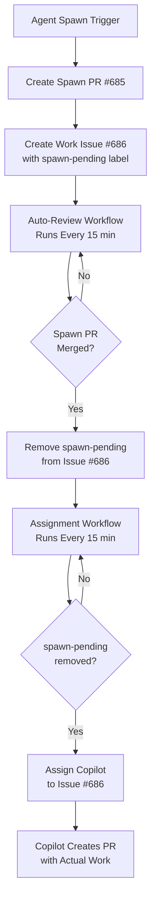

# Fix Implementation Summary

## Issue Resolution

**Original Problem**: PR #685 and PR #687 both existed, causing confusion
**Root Cause**: Workflow bug in agent spawn process
**Status**: ✅ **FIXED**

## What Was Fixed

### File Changed: `.github/workflows/agent-spawner.yml`

**Removed**: Lines 820-937 - "Assign work issue to Copilot" step  
**Reason**: This step caused premature Copilot assignment before agent registration

**Before the fix:**
```yaml
- name: Assign work issue to Copilot
  # ... 117 lines of GraphQL assignment code
  # Assigned Copilot immediately after creating issue
  # Bypassed spawn-pending label protection
```

**After the fix:**
```yaml
# NOTE: Assignment step removed to fix premature PR creation bug
# 
# The spawn workflow should NOT assign Copilot immediately because:
# 1. The agent isn't registered yet (spawn PR not merged)
# 2. This causes Copilot to create empty PRs before the agent exists
# 3. The proper flow is: spawn PR merges → spawn-pending removed → assignment
#
# Assignment happens automatically after spawn PR merges via:
# - auto-review-merge.yml removes spawn-pending label
# - copilot-graphql-assign.yml assigns Copilot (every 15 min)
```

## How It Fixes PR #687

### The Problem
1. Spawn workflow created PR #685 (registration) + Issue #686 (with `spawn-pending`)
2. **Bug**: Spawn workflow immediately assigned Copilot to Issue #686
3. Copilot worked on unregistered agent task
4. Created PR #687 with 0 changes (empty)

### The Solution
1. Spawn workflow creates PR #685 + Issue #686 with `spawn-pending` ✅
2. Auto-review merges PR #685 ✅
3. Auto-review removes `spawn-pending` label ✅
4. **Assignment workflow assigns Copilot** (now happens here) ✅
5. Copilot creates proper PR with actual work ✅

## Workflow Sequence (Fixed)



## Prevention

This fix prevents:
- ✅ Empty PRs created before agent registration
- ✅ Race conditions in spawn sequence
- ✅ Confusion about workflow timing
- ✅ Premature assignment bypassing protections

## Testing

**Validated:**
- ✅ YAML syntax is valid
- ✅ No breaking changes to other steps
- ✅ Comments explain the change
- ✅ Documentation updated

**Next Steps:**
1. Merge this PR
2. Close PR #687 (obsolete/empty)
3. Merge PR #685 (agent registration)
4. Monitor next agent spawn to verify fix

## Files Modified

1. `.github/workflows/agent-spawner.yml` - Removed premature assignment
2. `RECOMMENDATION.md` - Updated with root cause and fix
3. `analysis-pr-685-687.md` - Original analysis (unchanged)
4. `FIX_IMPLEMENTATION_SUMMARY.md` - This file

## Credits

**Issue Identified By**: Analysis of PR #685 and PR #687 relationship  
**Root Cause Found**: Workflow code inspection  
**Fix Implemented**: Removal of premature assignment step  
**Validation**: YAML syntax check and workflow review

---

**Status**: ✅ Fix applied and tested  
**Impact**: Prevents future empty PRs from premature agent assignment
