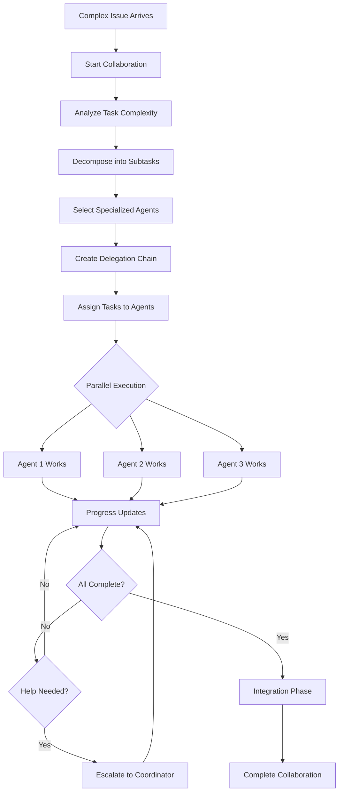

# Collaborative Agent Orchestrator

## Overview

The **Collaborative Agent Orchestrator** is a unified system for coordinating specialized AI agents on complex tasks within the Chained autonomous AI ecosystem. It combines the capabilities of the `MetaAgentCoordinator` and `HierarchicalAgentSystem` to provide a complete solution for multi-agent collaboration.

## Features

- **Unified Interface**: Single entry point for all multi-agent coordination needs
- **Real-time Collaboration Protocol**: Message-based communication between agents
- **Progress Tracking**: Monitor subtask completion in real-time
- **Session Management**: Persistent collaboration sessions with full history
- **Hierarchical Delegation**: Support for coordinator → specialist → worker tiers
- **Automatic Agent Selection**: Performance-based agent assignment
- **Parallel & Sequential Execution**: Smart dependency management
- **Help & Escalation**: Built-in support for agent assistance requests

## Quick Start

### Starting a Collaboration

```python
from collaborative_agent_orchestrator import CollaborativeAgentOrchestrator

orchestrator = CollaborativeAgentOrchestrator()

# Start a collaboration session for a complex task
session = orchestrator.start_collaboration(
    task_id="issue-123",
    task_description="""
        Build a secure authentication API:
        - Security audit and threat modeling
        - Design RESTful endpoints
        - Implement with performance optimization
        - Add comprehensive test coverage
        - Write API documentation
    """,
    task_context={'labels': ['security', 'api']}
)

print(f"Session: {session.session_id}")
print(f"Status: {session.status.value}")
print(f"Subtasks: {len(session.plan.sub_tasks)}")
print(f"Agents: {', '.join(session.participating_agents)}")
```

### Tracking Progress

```python
# Update progress on a subtask
orchestrator.update_progress(
    session_id=session.session_id,
    subtask_id="issue-123-subtask-1",
    progress=75.0,
    agent_id="engineer-master"
)

# Get session summary
summary = orchestrator.get_session_summary(session.session_id)
print(f"Overall progress: {summary['overall_progress']}%")
```

### Agent Communication

```python
from collaborative_agent_orchestrator import AgentMessage

# Send a message between agents
orchestrator.send_message(
    session_id=session.session_id,
    from_agent="engineer-master",
    to_agents=["meta-coordinator"],
    message_type=AgentMessage.PROGRESS_UPDATE,
    content={'status': 'API implementation complete'}
)

# Request help from coordinator
orchestrator.request_help(
    session_id=session.session_id,
    from_agent="assert-specialist",
    subtask_id="issue-123-subtask-3",
    reason="Need clarification on test coverage requirements"
)

# Report a blocked task
orchestrator.report_blocked(
    session_id=session.session_id,
    from_agent="document-ninja",
    subtask_id="issue-123-subtask-5",
    blocking_subtasks=["issue-123-subtask-1", "issue-123-subtask-2"],
    reason="Waiting for API implementation to complete"
)
```

## Architecture

```
┌─────────────────────────────────────────────────────────────┐
│            Collaborative Agent Orchestrator                  │
├─────────────────────────────────────────────────────────────┤
│                                                              │
│  ┌──────────────────────┐    ┌──────────────────────────┐  │
│  │  MetaAgentCoordinator │    │ HierarchicalAgentSystem  │  │
│  │  ─────────────────── │    │ ────────────────────────  │  │
│  │  • Task Analysis      │    │ • Role-based Tiers       │  │
│  │  • Decomposition      │    │ • Delegation Rules       │  │
│  │  • Agent Selection    │    │ • Escalation Support     │  │
│  └──────────────────────┘    └──────────────────────────┘  │
│                 │                         │                  │
│                 └──────────┬──────────────┘                  │
│                            ▼                                 │
│  ┌──────────────────────────────────────────────────────┐  │
│  │              Collaboration Session                    │  │
│  │  ────────────────────────────────────────────────    │  │
│  │  • Progress Tracking    • Message Queue              │  │
│  │  • Agent Coordination   • Status Management          │  │
│  │  • Delegation Chain     • Session Persistence        │  │
│  └──────────────────────────────────────────────────────┘  │
│                                                              │
└─────────────────────────────────────────────────────────────┘
```

## Collaboration Flow



## Collaboration Statuses

| Status | Description |
|--------|-------------|
| `INITIALIZING` | Session is being set up |
| `PLANNING` | Task is being analyzed and decomposed |
| `DELEGATING` | Tasks are being assigned to agents |
| `EXECUTING` | Agents are actively working |
| `INTEGRATING` | All subtasks complete, integrating results |
| `COMPLETED` | Collaboration successfully finished |
| `FAILED` | Collaboration encountered fatal error |
| `PAUSED` | Collaboration temporarily paused |

## Message Types

| Type | Purpose |
|------|---------|
| `TASK_ASSIGNED` | New task assigned to agent |
| `TASK_STARTED` | Agent has started working |
| `PROGRESS_UPDATE` | Progress report from agent |
| `BLOCKED` | Agent is blocked by dependencies |
| `HELP_NEEDED` | Agent needs assistance |
| `TASK_COMPLETED` | Agent completed their task |
| `INTEGRATION_READY` | Ready for final integration |
| `REVIEW_REQUESTED` | Work ready for review |

## Command-Line Interface

```bash
# Start a collaboration
python3 tools/collaborative_agent_orchestrator.py start \
    --task-id "issue-123" \
    --description "Build secure API with testing"

# Check session status
python3 tools/collaborative_agent_orchestrator.py status \
    --session-id "collab-issue-123-20240101-abc123"

# List active sessions
python3 tools/collaborative_agent_orchestrator.py list --active

# Update progress
python3 tools/collaborative_agent_orchestrator.py progress \
    --session-id "collab-issue-123-..." \
    --subtask-id "issue-123-subtask-1" \
    --progress 75 \
    --agent "engineer-master"

# View collaboration statistics
python3 tools/collaborative_agent_orchestrator.py stats
```

## Integration with Agent System

The orchestrator integrates seamlessly with the existing Chained agent system:

1. **Agent Registry**: Reads from `.github/agent-system/registry.json`
2. **Agent Definitions**: Uses agent specializations from `.github/agents/`
3. **Performance Metrics**: Selects agents based on performance scores
4. **Session Storage**: Persists to `.github/agent-system/collaboration_sessions.json`

## Example: Full Collaboration Workflow

```python
from collaborative_agent_orchestrator import (
    CollaborativeAgentOrchestrator,
    AgentMessage,
    CollaborationStatus
)

# Initialize
orchestrator = CollaborativeAgentOrchestrator()

# Start collaboration
session = orchestrator.start_collaboration(
    task_id="auth-api-v2",
    task_description="""
        Build v2 of the authentication API:
        - Migrate from JWT to OAuth 2.0
        - Add multi-factor authentication
        - Implement rate limiting
        - Add comprehensive security tests
        - Update API documentation
    """
)

# Simulate agent work
subtasks = list(session.progress.keys())

# Agent 1 starts security work
orchestrator.send_message(
    session_id=session.session_id,
    from_agent="secure-specialist",
    to_agents=["meta-coordinator"],
    message_type=AgentMessage.TASK_STARTED,
    content={'subtask_id': subtasks[0]}
)

# Agent 1 completes security work
orchestrator.mark_subtask_completed(
    session_id=session.session_id,
    subtask_id=subtasks[0],
    agent_id="secure-specialist"
)

# Agent 2 needs help
orchestrator.request_help(
    session_id=session.session_id,
    from_agent="engineer-master",
    subtask_id=subtasks[1],
    reason="Need clarification on OAuth 2.0 implementation"
)

# Continue until all complete...
for subtask_id in subtasks:
    orchestrator.update_progress(
        session_id=session.session_id,
        subtask_id=subtask_id,
        progress=100.0,
        agent_id="coordinator"
    )

# Complete collaboration
result = orchestrator.complete_collaboration(
    session_id=session.session_id,
    summary="Auth API v2 successfully implemented with all security requirements"
)

# Get final summary
summary = orchestrator.get_session_summary(session.session_id)
print(f"Duration: {summary['duration']}")
print(f"Messages: {summary['message_count']}")
print(f"Agents: {len(summary['participating_agents'])}")
```

## Testing

Run the test suite:

```bash
python3 tests/test_collaborative_agent_orchestrator.py
```

Tests cover:
- Orchestrator initialization
- Simple and complex collaboration starts
- Session persistence
- Progress tracking
- Message sending and reading
- Help requests and blocked reports
- Review requests
- Subtask and collaboration completion
- Session summaries
- Active session listing
- Collaboration statistics
- Delegation chain creation
- Task context handling

## Related Components

- **MetaAgentCoordinator** (`tools/meta_agent_coordinator.py`): Task analysis and decomposition
- **HierarchicalAgentSystem** (`tools/hierarchical_agent_system.py`): Role-based agent hierarchy
- **Meta-Coordinator Agent** (`.github/agents/meta-coordinator.md`): Agent definition for coordination
- **Meta-Coordinator System** (`.github/agents/meta-coordinator-system.md`): Autonomous orchestrator

## Best Practices

1. **Clear Task Descriptions**: Provide detailed descriptions for better decomposition
2. **Context Matters**: Include labels and related information in task_context
3. **Track Progress**: Regularly update progress for visibility
4. **Use Messages**: Communicate blockers and help needs through messages
5. **Complete Subtasks**: Mark subtasks complete to track overall progress
6. **Review Sessions**: Use summaries to monitor collaboration health

---

*Part of the Chained autonomous AI ecosystem - Orchestrating brilliant collaborations.* 🎯
